# AI Beta Reader Frontend

A Vue.js frontend for the AI Beta Reader application. Manage your books and chapters, edit content with a rich markdown editor, generate AI summaries, and get contextual feedback on your writing.

## Tech Stack

- **Frontend:** Vue 3 (Composition API) + TypeScript + Vite
- **Styling:** Tailwind CSS + Headless UI + Heroicons
- **State & Data:** Pinia, @tanstack/vue-query
- **Local Storage:** `sql.js` (browser) / `@capacitor-community/sqlite` (native)
- **Cloud Sync:** Google Drive via OAuth 2.0 (GIS for web, PKCE + App Links for native)
- **AI Services:** OpenAI (GPT‑4o Mini) for summaries & reviews
- **Backend Repository:** [ai-beta-reader-backend](https://github.com/gennitdev/ai-beta-reader-backend)

## Features

### Core Writing Tools

- **Book Management**: Create and organize your writing projects with support for parts/sections
- **Chapter Editor**: Rich markdown editor with live preview and word count tracking
- **Responsive Design**: Works seamlessly on desktop and mobile devices

### AI-Powered Features

- **Smart Chapter Summaries**: Auto-generate structured summaries that track plot points, characters, and key events to maintain continuity across long manuscripts
- **Contextual AI Reviews**: Get intelligent feedback that understands your entire story:
  - Reviews use summaries of previous chapters as context
  - No need to explain backstory - the AI already knows what happened
  - Efficient token usage even for long manuscripts
- **Multiple Review Styles**:
  - Fan style (enthusiastic reader feedback)
  - Editorial notes (developmental editor perspective)
  - Line editor (concrete, actionable suggestions)
- **Custom AI Profiles**: Create personalized reviewer profiles with custom prompts to get the exact type of feedback you need

### Continuity Management & Storage

- **Local-first data**: Every project lives in a local SQLite database (browser or device). Nothing leaves the device unless you explicitly back up.
- **Encrypted backups**: `ai-beta-reader-backup.enc` is AES-encrypted with your password before uploading to Google Drive.
- **Drive restore**: Restore the same encrypted blob from any device (web or Android). Native uses PKCE OAuth and App Links to re-enter the app after Google consent.
- **Story bible**: Character sheets, wiki pages, change history, and cross-document search keep continuity intact.
- **Find & replace**: Rename characters/places everywhere in one shot.
- **Drag & drop parts**: Reorder chapters and group them into parts.

## Screenshots

### AI Summary Generation

Clicking the generate summary button generates structured summaries that track characters, plot points, and key events for each chapter.

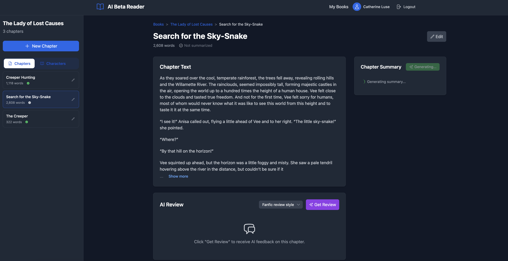

### Summary Management

You can manually edit or regenerate summaries to ensure they accurately capture the important details that will provide context for AI reviews.


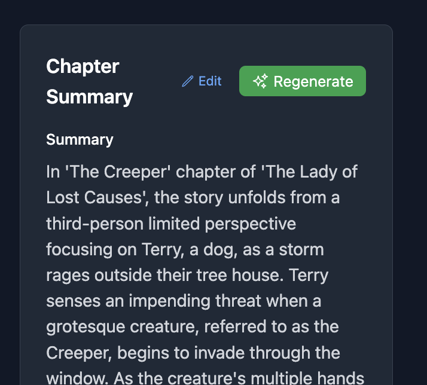

### AI Review Transparency

The app shows you exactly what summaries are being sent to the AI as context, giving you full transparency into the review process.

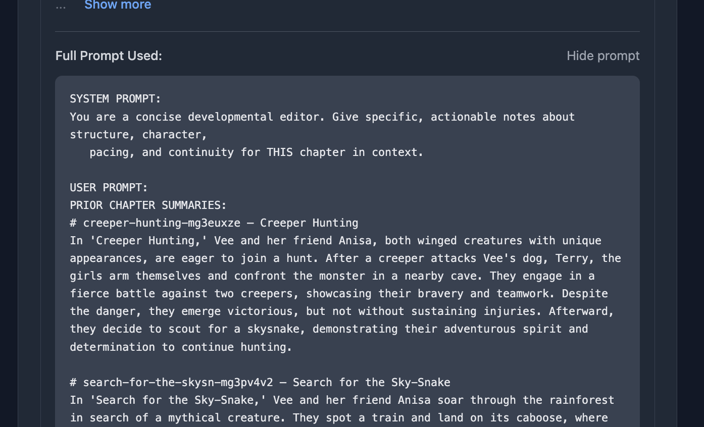

### Contextual AI Feedback

Get intelligent feedback that understands your story's continuity and can catch inconsistencies across chapters.

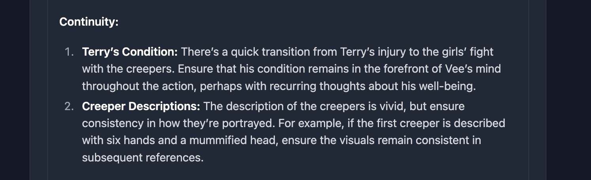

### Custom AI Profiles

Create personalized reviewer profiles with custom prompts to get the exact type of feedback you need.

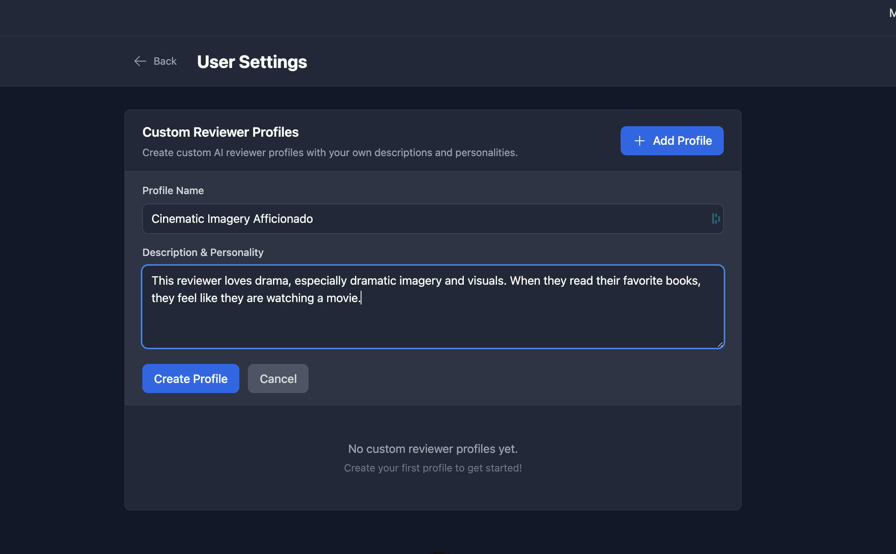

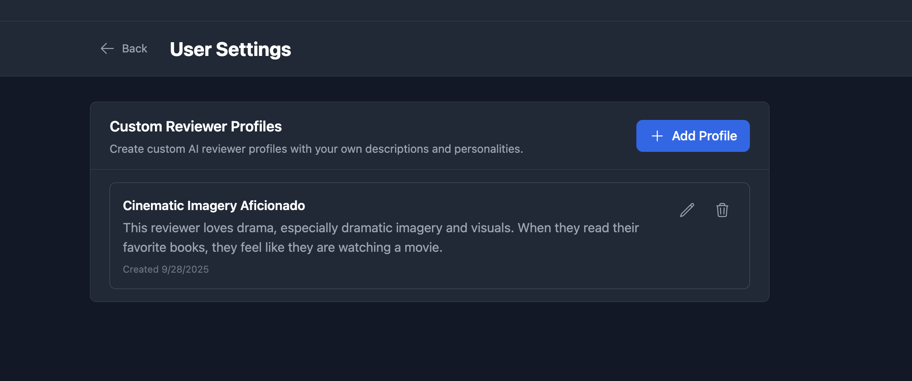

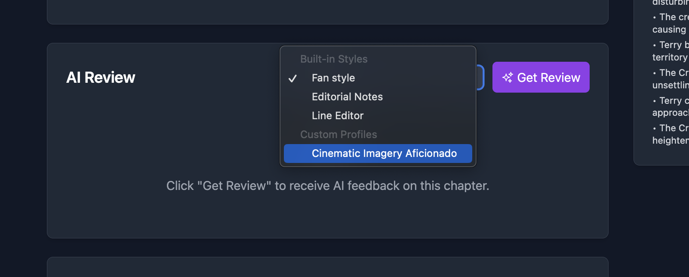

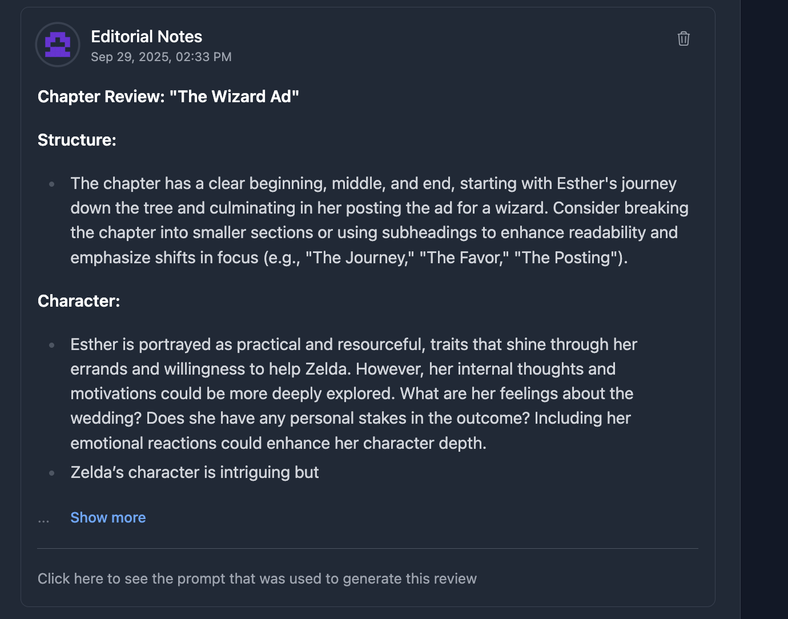

### Character Wiki System

Automatically generated character sheets that track relationships and development, with full edit history.

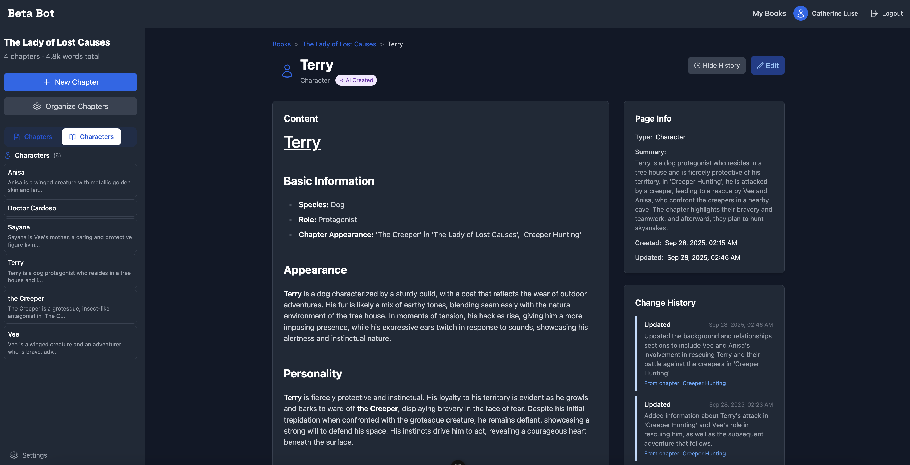

### Search and Replace for Continuity

Find and replace text across all chapters and wiki pages to maintain consistency throughout your manuscript.

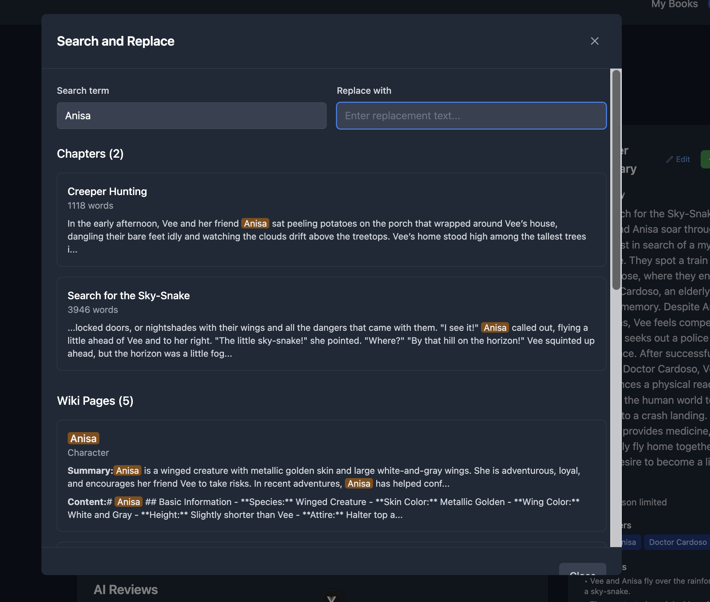

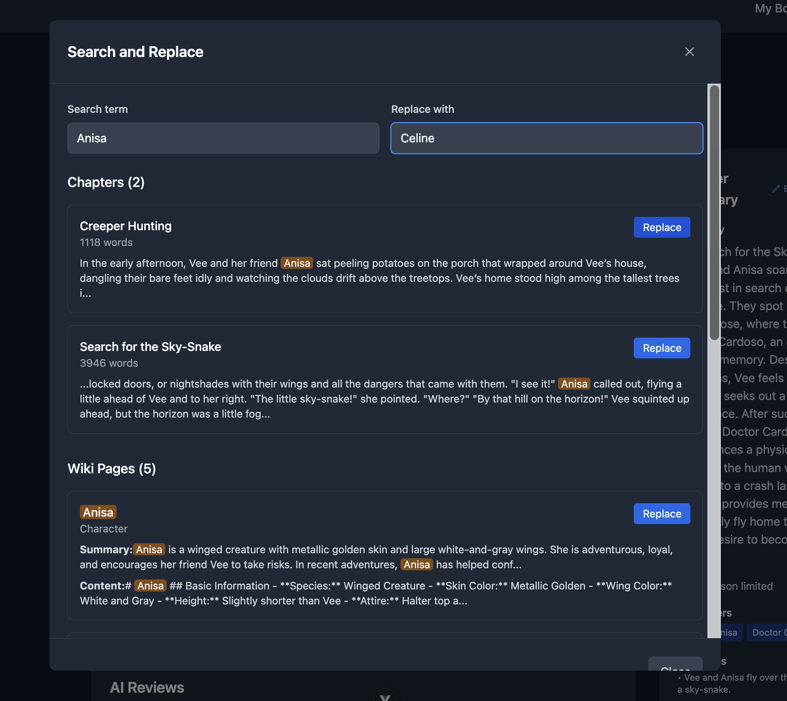

## Prerequisites for Self Hosting Beta-bot

- Node.js 18+
- Google Cloud project with Drive API enabled and OAuth clients (web + Android)
- AI Beta Reader Express backend running

## Setup

1. **Install dependencies:**

   ```bash
   npm install
   ```

2. **Configure environment variables:**
   Copy `.env.example` to `.env.local` and supply your Google OAuth web + Android client IDs. Adjust `VITE_API_BASE_URL` if you run a different backend origin.

3. **Start development server:**

   ```bash
   npm run dev
   ```

## Environment Variables

Create a `.env.local` file (or copy [.env.example](.env.example)) and configure the following variables.

> Full walkthrough (OAuth clients, SHA‑1s, troubleshooting): see [`docs/cloud-sync.md`](docs/cloud-sync.md).

### Google OAuth (Drive sync)

| Variable | Description | Example |
|----------|-------------|---------|
| `VITE_GOOGLE_CLIENT_ID` | Google OAuth *web* client ID (used for browser GIS flow) | `302250506015-du7cd7e5g469dd74cs2fnq8luksiuutb.apps.googleusercontent.com` |
| `VITE_GOOGLE_CLIENT_ID_WEB` | Optional alias for the web client (defaults to `VITE_GOOGLE_CLIENT_ID`) | same as above |
| `VITE_GOOGLE_REDIRECT_URI` | Hosted redirect used by the web build | `https://www.beta-bot.net/oauth2redirect` |
| `VITE_GOOGLE_CLIENT_ID_NATIVE` | Android OAuth client ID (PKCE/native flow) | `…hmm4hpdloehtuodde00pu2irqkpm1inp.apps.googleusercontent.com` |
| `VITE_GOOGLE_REDIRECT_URI_NATIVE` | Custom redirect scheme from the Android client | `com.googleusercontent.apps.…:/oauth2redirect` |
| `VITE_GOOGLE_CLIENT_SECRET` | **Optional** – only required if you re-use the web client in native builds (not recommended) | |

### Backend API

| Variable | Description | Default |
|----------|-------------|---------|
| `VITE_API_BASE_URL` | Backend API base URL | `http://localhost:3001` |

### Notes

- All frontend environment variables must be prefixed `VITE_`.
- `.env.local` is git-ignored; replicate values in Vercel → Project → Environment Variables for production/preview builds.

## How the App Works

### Local-first Database

- **Browser builds** load `sql.js` (WASM SQLite). The database is cached in `localStorage` (`sqliteDb` key).
- **Native builds** use `@capacitor-community/sqlite`. Data lives in the device sandbox at `ai-beta-reader`.
- All user actions (adding books, editing chapters, creating wiki entries) mutate the local DB immediately.
- When you export/import, the app serialises the entire database to JSON for portability.

### Google Drive Backup & Restore

1. **Backup** (`User Settings → Back up to Drive`)
   - Prompts for a password (used to encrypt the JSON dump via `CryptoJS.AES`).
   - Uploads `ai-beta-reader-backup.enc` with Drive scope `drive.file`.
   - Re-running backup overwrites the same file id (Drive `files.update`).
   - Mobile + desktop both emit the exact same snapshot format; you can restore a phone backup on web and vice versa.
   - Want to sanity-check a backup before restoring? See `docs/cloud-sync.md#verifying-a-backup-locally` for a tiny Node script that prints record counts.

2. **Restore** (`User Settings → Restore from Drive`)
   - Auth flow differs by platform:
     - **Web**: Google Identity Services token client (`response_type=token`).
     - **Android**: Custom PKCE helper opens Chrome via App Launcher, listens for App Link redirect (`com.googleusercontent.apps...:/oauth2redirect`), exchanges code for tokens, caches refresh token with `@capacitor/preferences`.
   - Downloads the encrypted blob, decrypts with the password you provide, and hydrates the local DB.
   - Foreign key constraints are disabled temporarily during import to avoid ordering errors.
   - Nothing gets uploaded automatically—restore only reads from Drive. You decide when to back up.

3. **Security**
   - Backups stay in your Google Drive. Only the authenticated account (or anyone you explicitly share the file with) can download it.
   - The encryption password is never stored; losing it makes the backup unreadable.
  - Native access tokens are stored using Capacitor Preferences; revoke them via Android’s Developer Options if needed.

See [`docs/cloud-sync.md`](docs/cloud-sync.md) for troubleshooting (client secrets, SHA‑1 mismatches, status bar overlays, etc.).

### AI Summaries & Reviews

- Every chapter can generate a “structured summary” capturing POV, characters, beats, spoilers.
- When requesting feedback, the prompt includes:
  - Current chapter text
  - Summaries of previous chapters
  - Relevant metadata (characters, wiki info)
- Multiple reviewer tones (fan, editorial, line edit) + custom profiles stored in the local DB.

### Search, Wiki, and Story Bible

- Wiki pages track concepts/characters with update history.
- Cross-document search covers chapters + wiki entries.
- Find/replace spans every chapter to keep continuity.
- Chapters can be grouped into parts; reorder via drag & drop (Pinia stores keep UI state in sync).

## Development Workflow

```bash
npm install          # install deps
npm run dev          # local dev server (Vite)
npm run build        # type-check + production bundle (outputs to dist/)
npx cap sync android # sync Capacitor plugins & web assets (run after build)
npx cap run android --target <serial>  # deploy to device/emulator
npm run preview      # serve production bundle locally
npm run lint         # eslint --fix
npm run type-check   # vue-tsc --build
```

## Hosting & Deployment

- **Web (beta-bot.net)**: Vercel builds from `main`. Make sure the env vars above are set in Vercel before deploying.
- **Android**: Use `npx cap sync android` after every `npm run build`. Launch via Android Studio or the `npx cap run` helper.
  - The Android OAuth client must include:
    - Package name `com.betareader.app`
    - SHA‑1 fingerprint from `./gradlew signingReport`
    - Custom URI scheme enabled (`com.googleusercontent.apps.<client-id>:/oauth2redirect`)
  - Status bar height is handled via `@capacitor/status-bar` to avoid UI overlap.

## Troubleshooting Cheat Sheet

| Problem | Fix |
|---------|-----|
| `client_secret is missing` on restore | The native build is still using the web OAuth client. Ensure Vercel + local envs define `VITE_GOOGLE_CLIENT_ID_NATIVE` and `VITE_GOOGLE_REDIRECT_URI_NATIVE`; redeploy. |
| `Access blocked: request invalid` (custom URI scheme) | Enable “Custom URI scheme” on the Android OAuth client. |
| `Access blocked: invalid_request` after redirect fix | Add the SHA‑1 fingerprint from `./gradlew signingReport` to the Android OAuth client. |
| `No backup found in cloud storage` | The Drive file doesn’t exist. Run a backup from the browser or ensure the file name matches `ai-beta-reader-backup.enc`. |
| `Failed to decrypt - wrong password? TypeError: this.db.importFromJson is not a function` | Fixed in native import logic (manual inserts). Update to latest build. |
| `FOREIGN KEY constraint failed (code 787)` | Latest build disables/re-enables foreign keys during import. Rebuild and redeploy. |
| `adb` can’t find the device | Reconnect cable, enable File Transfer mode, rerun `adb kill-server && adb start-server`, accept the trust prompt. |

## Need More Detail?

- [docs/cloud-sync.md](docs/cloud-sync.md) – end-to-end Google Drive setup, OAuth nuances, debugging steps.
- [ai-beta-reader-backend](https://github.com/gennitdev/ai-beta-reader-backend) – REST endpoints and AI worker integration.

Happy writing! ✍️📚
