# AI Beta Reader Frontend

A Vue.js frontend for the AI Beta Reader application. Manage your books and chapters, edit content with a rich markdown editor, generate AI summaries, and get contextual feedback on your writing.

**Backend Repository:** [ai-beta-reader-backend](https://github.com/gennitdev/ai-beta-reader-backend)

## Features

### Core Writing Tools
- **Auth0 Authentication**: Secure login and user management
- **Book Management**: Create and organize your writing projects with support for parts/sections
- **Chapter Editor**: Rich markdown editor with live preview and word count tracking
- **Responsive Design**: Works seamlessly on desktop and mobile devices

### AI-Powered Features
- **Smart Chapter Summaries**: Auto-generate structured summaries that track plot points, characters, and key events to maintain continuity across long manuscripts
- **Contextual AI Reviews**: Get intelligent feedback that understands your entire story:
  - Reviews use summaries of previous chapters as context
  - No need to explain backstory - the AI already knows what happened
  - Efficient token usage even for long manuscripts
- **Multiple Review Styles**:
  - Fan style (enthusiastic reader feedback)
  - Editorial notes (developmental editor perspective)
  - Line editor (concrete, actionable suggestions)
- **Custom AI Profiles**: Create personalized reviewer profiles with custom prompts to get the exact type of feedback you need

### Continuity Management
- **Interactive Character Sheets**: Auto-generated character profiles with smart linking between related characters
- **Wiki System**: Build a comprehensive story bible with interconnected pages for characters, locations, and concepts
- **Cross-Document Search**: Search across all chapters and wiki pages simultaneously
- **Find and Replace**: Make consistent changes across your entire manuscript with one click
- **Chapter Organization**: Drag-and-drop reordering with support for parts and uncategorized sections

## Prerequisites

- Node.js 18+
- Auth0 account configured
- AI Beta Reader Express backend running

## Setup

1. **Install dependencies:**
   ```bash
   npm install
   ```

2. **Configure environment:**
   Copy `.env.local` and update with your values:
   ```bash
   VITE_AUTH0_DOMAIN=your-auth0-domain.auth0.com
   VITE_AUTH0_CLIENT_ID=your-auth0-client-id
   VITE_AUTH0_AUDIENCE=your-auth0-audience
   VITE_API_BASE_URL=http://localhost:3001
   ```

3. **Start development server:**
   ```bash
   npm run dev
   ```

## Auth0 Configuration

In your Auth0 dashboard:

1. **Create a Single Page Application**
2. **Configure URLs:**
   - Allowed Callback URLs: `http://localhost:5173/callback`
   - Allowed Logout URLs: `http://localhost:5173`
   - Allowed Web Origins: `http://localhost:5173`

3. **Enable grants:**
   - Authorization Code
   - Refresh Token

## How It Works

### Getting Started
1. **Create Your Book**: Start a new project and give it a title
2. **Write Your First Chapter**: Add content using the markdown editor
3. **Generate AI Summary**: Click "Generate Summary" to create a structured overview that tracks characters, plot points, and key events

### The Magic of Context
4. **Add More Chapters**: Continue writing your story
5. **Get Contextual Reviews**: When you generate a review for a new chapter, the AI automatically receives:
   - The full text of your current chapter
   - Summaries of all previous chapters
   - Character and plot information

   This means the AI understands your story's context without you having to explain anything!

6. **Maintain Continuity**: As your manuscript grows, the system efficiently manages context using summaries, preventing token limits while maintaining story awareness

### Advanced Features
7. **Custom AI Profiles**: Create personalized reviewer profiles with specific prompts tailored to your needs
8. **Build Your Story Bible**: Create wiki pages for characters, locations, and concepts
9. **Search and Replace**: Find names, places, or any text across all chapters and make consistent changes
10. **Organize with Parts**: Group chapters into parts or sections for better manuscript organization

## Screenshots

### AI Summary Generation
Clicking the generate summary button generates structured summaries that track characters, plot points, and key events for each chapter.

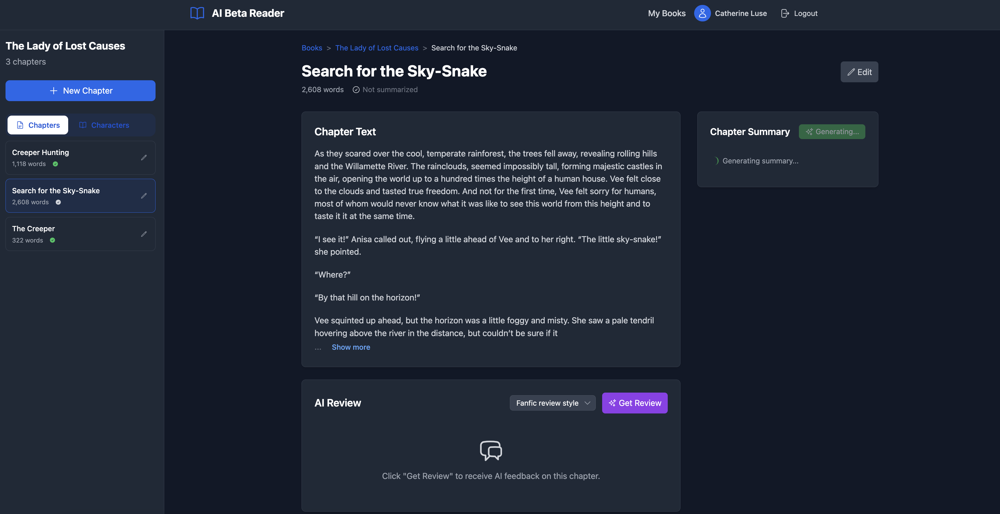

### Summary Management
You can manually edit or regenerate summaries to ensure they accurately capture the important details that will provide context for AI reviews.

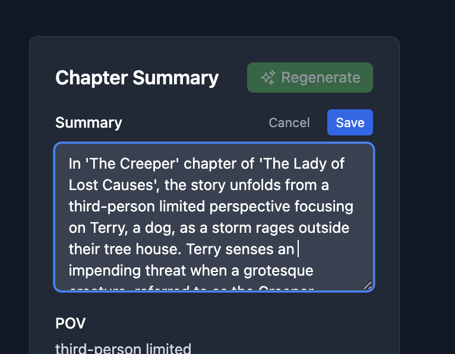

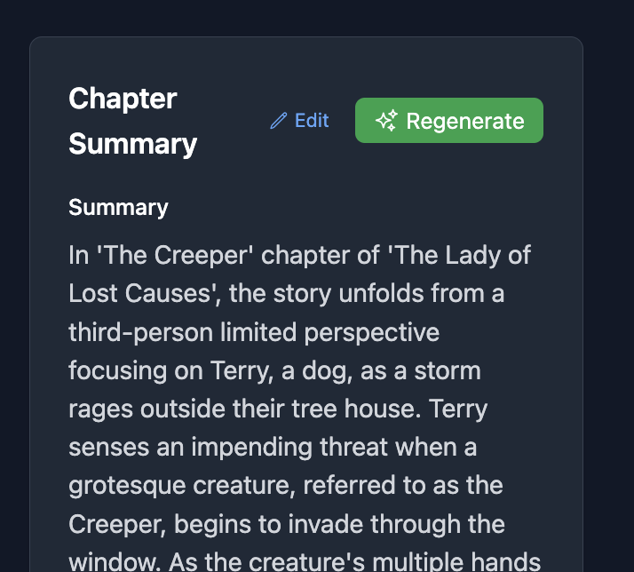

### AI Review Transparency
The app shows you exactly what summaries are being sent to the AI as context, giving you full transparency into the review process.

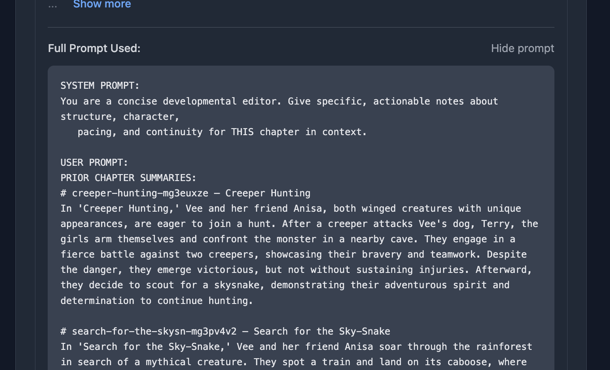

### Contextual AI Feedback
Get intelligent feedback that understands your story's continuity and can catch inconsistencies across chapters.

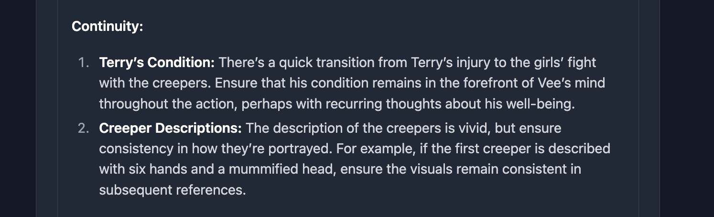

### Custom AI Profiles
Create personalized reviewer profiles with custom prompts to get the exact type of feedback you need.

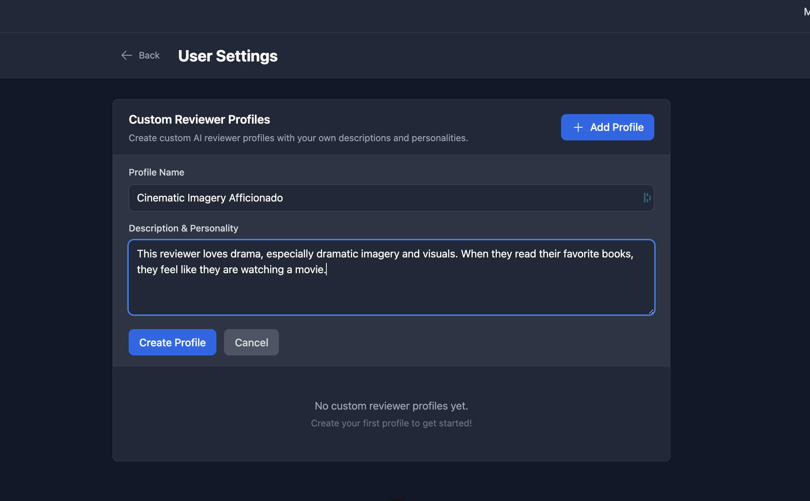

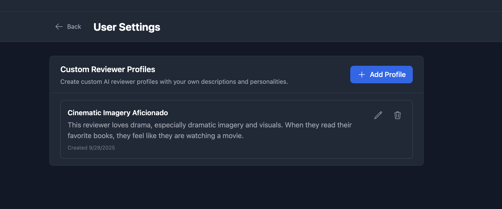

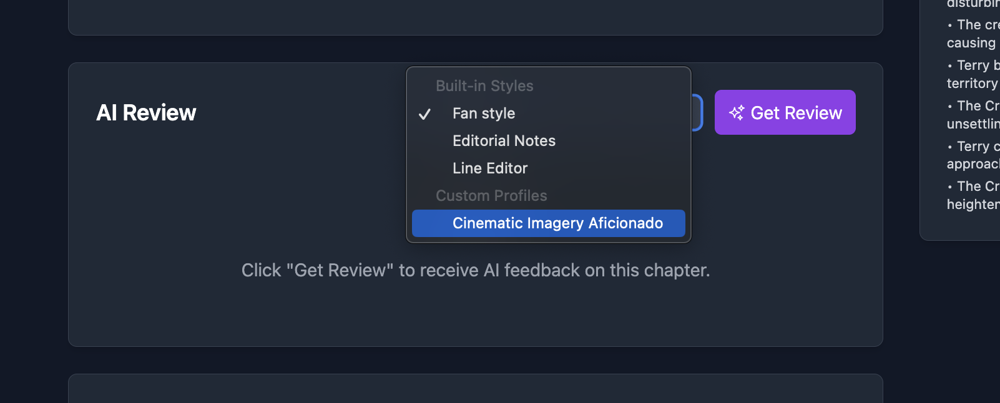

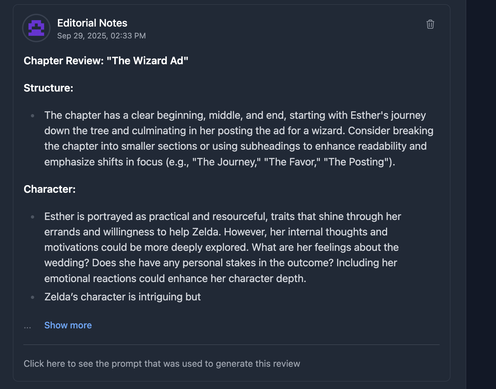

### Character Wiki System
Automatically generated character sheets that track relationships and development, with full edit history.

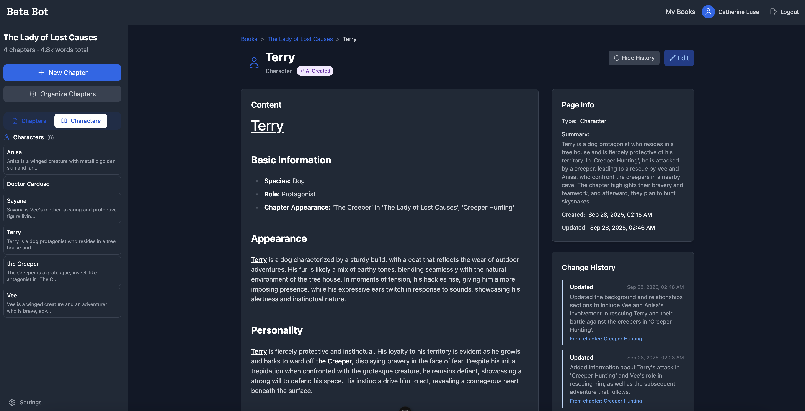

### Search and Replace for Continuity
Find and replace text across all chapters and wiki pages to maintain consistency throughout your manuscript.

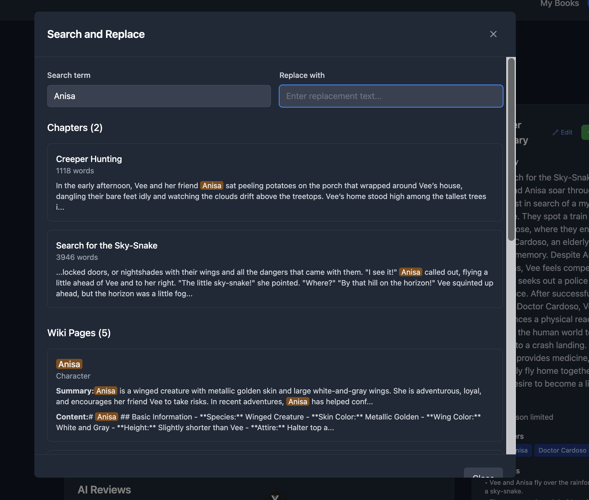

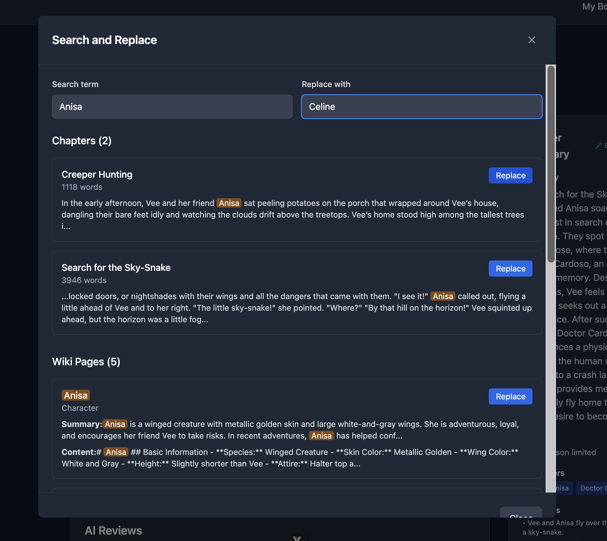

## Available Scripts

- `npm run dev` - Start development server
- `npm run build` - Build for production
- `npm run preview` - Preview production build
- `npm run lint` - Run ESLint