<p align="center">
  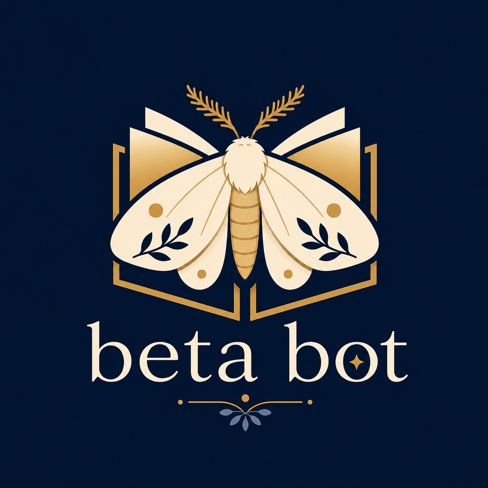
</p>

# beta bot

[](https://github.com/gennitdev/ai-beta-reader-frontend/actions/workflows/ci.yml)
[](https://codecov.io/gh/gennitdev/ai-beta-reader-frontend)

A local-first writing application for managing books and chapters, editing content with a rich markdown editor, generating AI summaries, and getting contextual feedback on your writing.

This repository contains the complete application code for the browser, Electron desktop, and Android builds. No separate application backend or API server is required: writing data is stored locally, AI requests are sent directly to OpenAI using the API key configured by the user, and optional encrypted backups communicate directly with Google Drive.

## Tech Stack

- **Application:** Vue 3 (Composition API) + TypeScript + Vite
- **Styling:** Tailwind CSS + Headless UI + Heroicons
- **State & Data:** Pinia, @tanstack/vue-query
- **Local Database:** `sql.js` + IndexedDB persistence (browser and Electron) / `@capacitor-community/sqlite` (Android)
- **Cloud Sync:** Google Drive via OAuth 2.0 (GIS for web, PKCE + App Links for native)
- **AI Services:** OpenAI (GPT‑4o Mini) for summaries & reviews
- **Native Platforms:** Capacitor for Android, Electron for desktop (macOS/Windows/Linux)

## Architecture

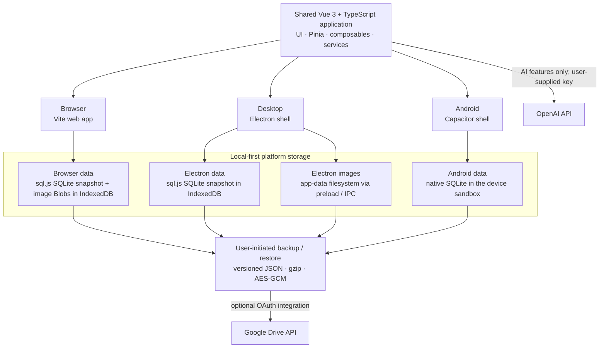
```mermaid
flowchart TB
  app["Shared Vue 3 + TypeScript application<br/>UI · Pinia · composables · services"]

  app --> web["Browser<br/>Vite web app"]
  app --> electron["Desktop<br/>Electron shell"]
  app --> android["Android<br/>Capacitor shell"]

  subgraph local["Local-first platform storage"]
    webDb["Browser data<br/>sql.js SQLite snapshot + image Blobs in IndexedDB"]
    electronDb["Electron data<br/>sql.js SQLite snapshot in IndexedDB"]
    electronImages["Electron images<br/>app-data filesystem via preload / IPC"]
    androidDb["Android data<br/>native SQLite in the device sandbox"]
  end

  web --> webDb
  electron --> electronDb
  electron --> electronImages
  android --> androidDb

  app -->|"AI features only; user-supplied key"| openai["OpenAI API"]

  webDb --> backup["User-initiated backup / restore<br/>versioned JSON · gzip · AES-GCM"]
  electronDb --> backup
  electronImages --> backup
  androidDb --> backup
  backup -->|"optional OAuth integration"| drive["Google Drive API"]
```

The browser, desktop, and Android targets share the same application and portable backup format. Platform adapters only change how the local SQLite database and image binaries are stored. OpenAI and Google Drive are contacted directly from the running client; there is no application server between them.

## Features

### Core Writing Tools

- **Book Management**: Create and organize your writing projects with support for parts/sections
- **Chapter Editor**: Rich markdown editor with live preview and word count tracking
- **Responsive Design**: Works seamlessly on desktop and mobile devices

### AI-Powered Features

- **Smart Chapter Summaries**: Auto-generate structured summaries that track plot points, characters, locations, and key events to maintain continuity across long manuscripts
  - A checkbox lets you update wiki pages for characters and locations detected while generating or regenerating a summary
  - Missing pages are created, existing pages are refreshed with new chapter information, and each result is linked back to its source chapter
- **Contextual AI Reviews**: Get intelligent feedback that understands your entire story:
  - Reviews use summaries of previous chapters as context
  - No need to explain backstory - the AI already knows what happened
  - Efficient token usage even for long manuscripts
- **Multiple Review Styles**:
  - Fan style (enthusiastic reader feedback)
  - Editorial notes (developmental editor perspective)
  - Line editor (concrete, actionable suggestions)
- **Custom AI Profiles**: Create personalized reviewer profiles with custom prompts to get the exact type of feedback you need

### Continuity Management & Storage

- **Local-first data**: Every project lives in a local SQLite database. Backups are user-initiated; AI features send the selected manuscript context to the configured AI service when invoked.
- **Encrypted backups**: The database snapshot is compressed, encrypted with a password-derived AES-GCM key, and uploaded to Google Drive as `ai-beta-reader-backup.enc`.
- **Cross-platform restore**: Browser, Electron, and Android use the same versioned JSON snapshot format. Android uses PKCE OAuth and App Links to re-enter the app after Google consent.
- **Story bible**: Character sheets and wiki pages can record human-edited alternate names, helping AI updates resolve nicknames and titles to one canonical page.
- **Find & replace**: Rename characters/places everywhere in one shot.
- **Drag & drop parts**: Reorder chapters and group them into parts.

### Chapter Illustrations

- **Browser and Electron image management**: Add and manage chapter illustrations plus book, part, and chapter covers
- **Local binary storage**: Browser images are stored as IndexedDB `Blob` records; Electron images live in the app-data directory
- **Chapter covers**: Set any illustration as the chapter's cover image for visual navigation
- **Lightbox viewer**: View images full-screen with download option
- **Storage and backup**: Drive backup embeds image data in the encrypted snapshot so browser and Electron restores preserve the image library.

## Screenshots

### AI Summary Generation

Clicking the generate summary button generates structured summaries that track characters, plot points, and key events for each chapter.

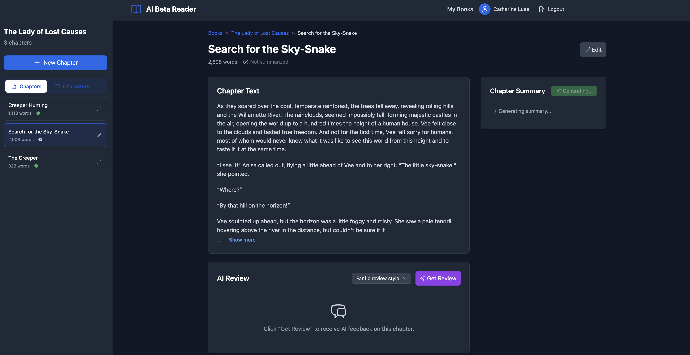

### Summary Management

You can manually edit or regenerate summaries to ensure they accurately capture the important details that will provide context for AI reviews.

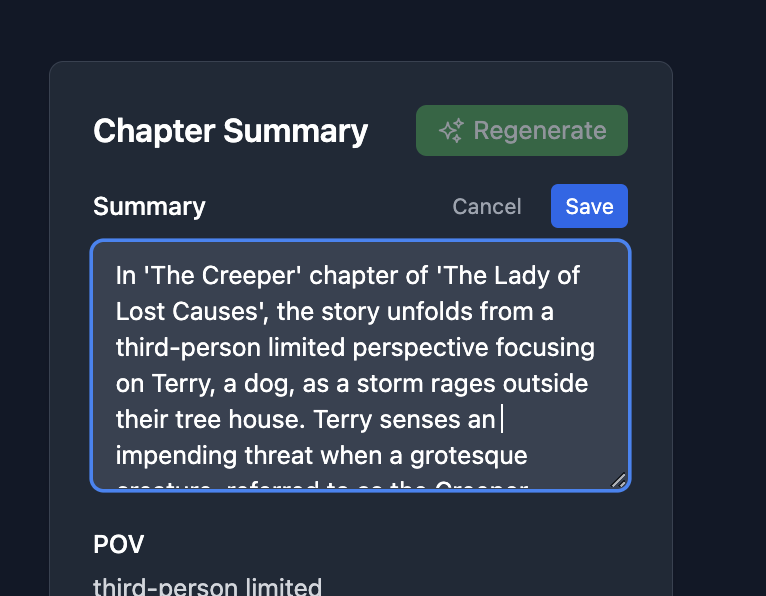

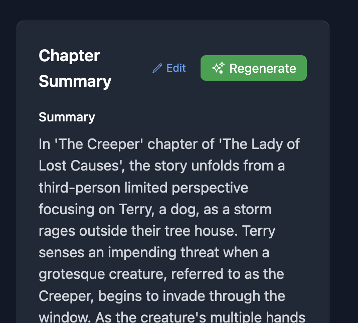

### AI Review Transparency

The app shows you exactly what summaries are being sent to the AI as context, giving you full transparency into the review process.

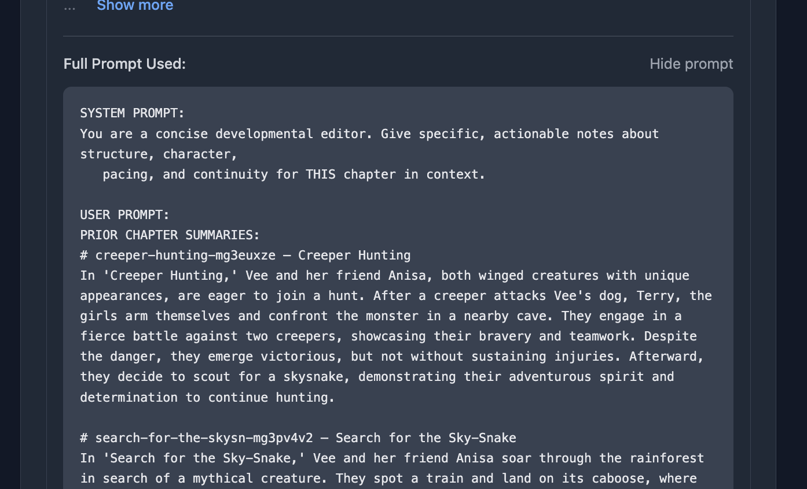

### Contextual AI Feedback

Get intelligent feedback that understands your story's continuity and can catch inconsistencies across chapters.

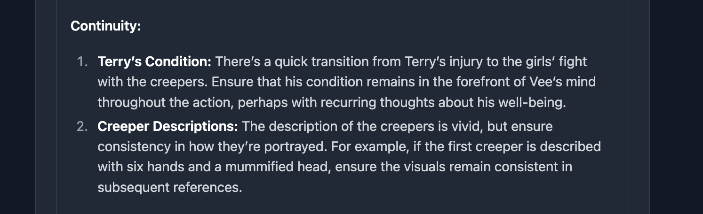

### Custom AI Profiles

Create personalized reviewer profiles with custom prompts to get the exact type of feedback you need.

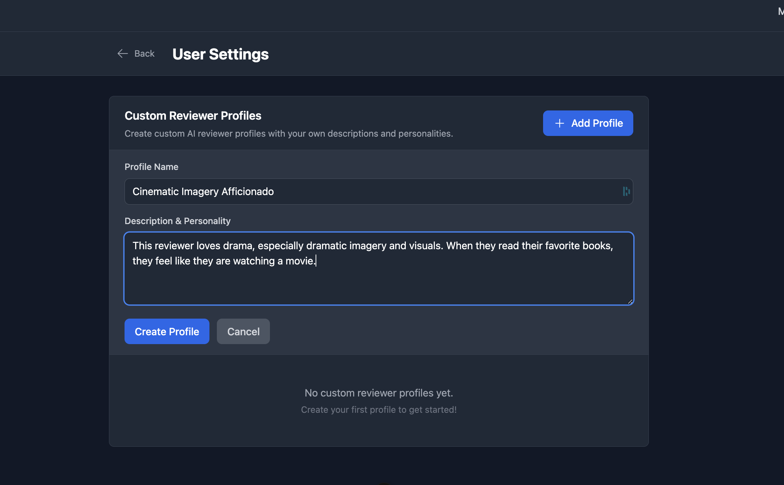

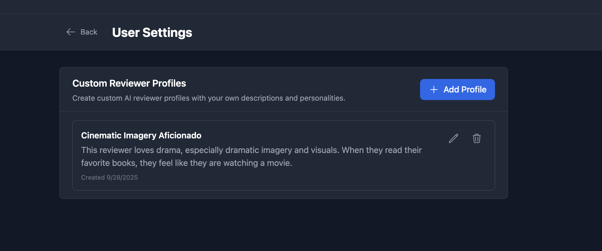

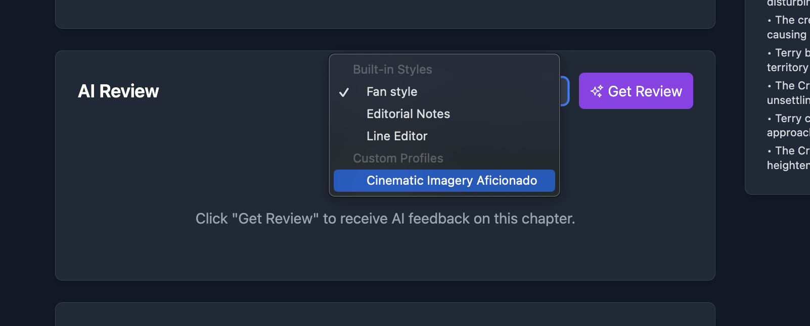

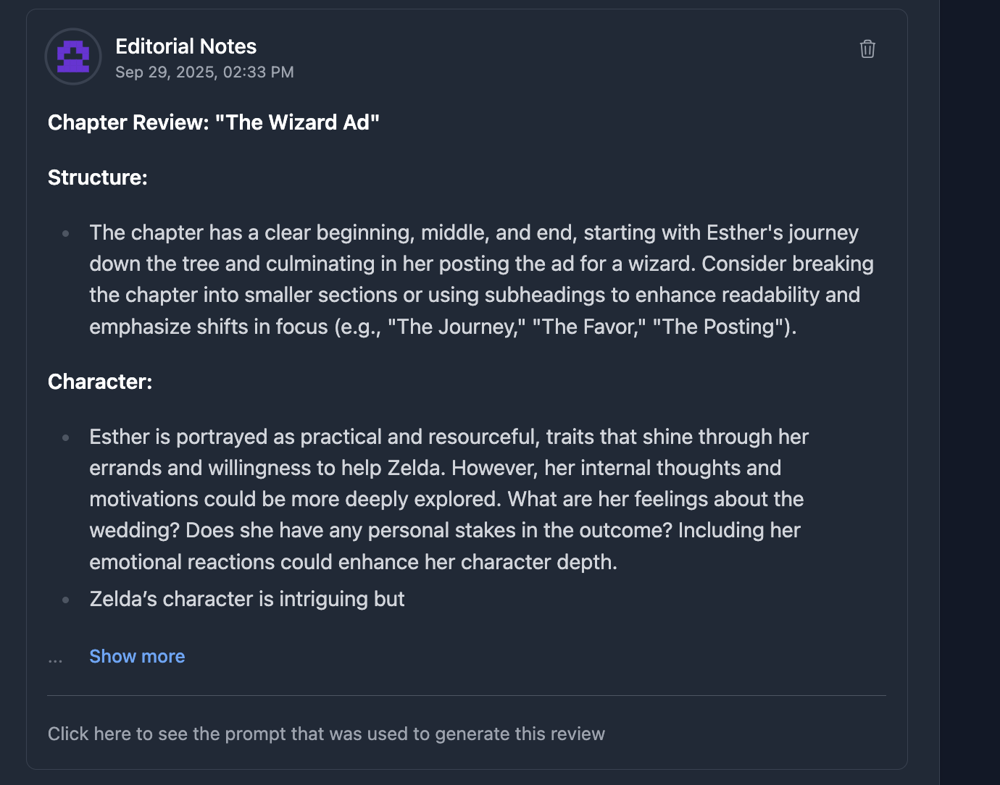

### Character Wiki System

Wiki pages can be maintained by hand or updated as part of chapter summary generation. Before selecting **Generate** or **Regenerate**, use the **Update wiki pages for detected characters and locations** checkbox to control whether the AI should:

- Create pages for newly detected characters and locations
- Add relevant chapter information to existing pages
- Record the source chapter and a history entry for each creation or update
- Resolve nicknames, titles, and other alternate names to an existing canonical page

After generation, the summary panel reports which pages were created, updated, or left unchanged and provides links to review them.

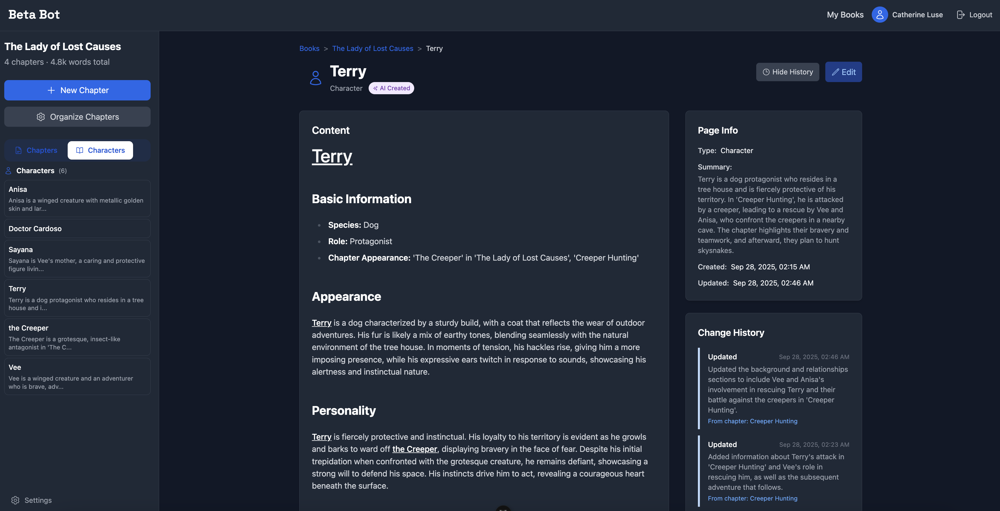

### Search and Replace for Continuity

Review individual matches before replacing text across your entire manuscript, or limit the operation to the current chapter or wiki page. Matches are grouped by document and field, with controls to replace one, selected matches, or every match in a document.

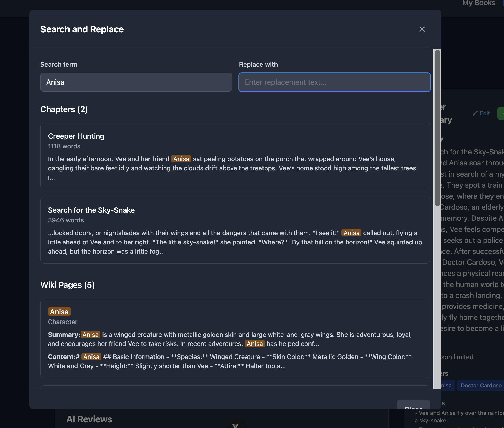

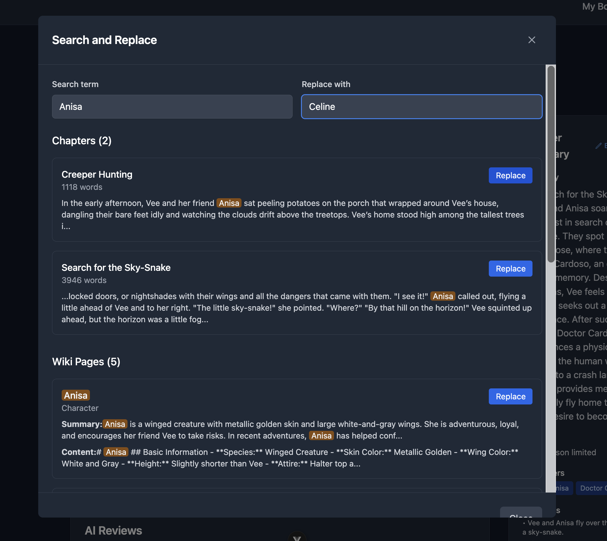

## Prerequisites for Self Hosting beta bot

- Node.js 20.19+ or 22.12+
- An OpenAI API key, entered in the app, to use AI summaries and reviews
- Optional: a Google Cloud project with the Drive API enabled and appropriate OAuth clients if you want Google Drive backup and restore

## Setup

1. **Install dependencies:**

   ```bash
   npm install
   ```

2. **Optional: configure Google Drive backup and restore:**
   Copy `.env.example` to `.env.local` and supply the Google OAuth client IDs for the platforms you intend to run. You can skip this step when Drive sync is not needed.

3. **Start development server:**

   ```bash
   npm run dev
   ```

## Environment Variables

Create a `.env.local` file (or copy [.env.example](.env.example)) and configure the following variables.

> Full walkthrough (OAuth clients, SHA‑1s, troubleshooting): see [`docs/cloud-sync.md`](docs/cloud-sync.md).

### Google OAuth (Drive sync)

| Variable | Description | Example |
|----------|-------------|---------|
| `VITE_GOOGLE_CLIENT_ID` | Google OAuth *web* client ID (used for browser GIS flow) | `302250506015-du7cd7e5g469dd74cs2fnq8luksiuutb.apps.googleusercontent.com` |
| `VITE_GOOGLE_CLIENT_ID_WEB` | Optional alias for the web client (defaults to `VITE_GOOGLE_CLIENT_ID`) | same as above |
| `VITE_GOOGLE_REDIRECT_URI` | Hosted redirect used by the web build | `https://www.beta-bot.net/oauth2redirect` |
| `VITE_GOOGLE_CLIENT_ID_NATIVE` | Android OAuth client ID (PKCE/native flow) | `…hmm4hpdloehtuodde00pu2irqkpm1inp.apps.googleusercontent.com` |
| `VITE_GOOGLE_REDIRECT_URI_NATIVE` | Custom redirect scheme from the Android client | `com.googleusercontent.apps.…:/oauth2redirect` |
| `VITE_GOOGLE_CLIENT_SECRET` | **Optional** – only required if you re-use the web client in native builds (not recommended) | |

### Notes

- All environment variables exposed to the Vite application must be prefixed `VITE_`.
- `.env.local` is git-ignored; replicate values in Vercel → Project → Environment Variables for production/preview builds.
- The app does not require `VITE_API_BASE_URL` or a separately running Express server.

## How the App Works

### Local-first Database

- **Browser and Electron builds** run `sql.js` (SQLite compiled to WebAssembly). The exported SQLite bytes are persisted in IndexedDB under the `ai-beta-reader-db` database. Existing installs with the legacy `localStorage.sqliteDb` value migrate it to IndexedDB during startup.
- **Android builds** use `@capacitor-community/sqlite`. Data lives in the device sandbox in the `ai-beta-reader` database.
- All user actions (adding books, editing chapters, creating wiki entries) mutate the local DB immediately.
- Export/import serializes the database tables to a versioned JSON snapshot for portability between storage engines.
- Browser image bytes live in the IndexedDB `imageBlobs` object store. SQLite keeps only image metadata during normal use; legacy base64 rows migrate automatically in restartable batches.

### Google Drive Backup & Restore

1. **Backup** (`User Settings → Back up to Drive`)
   - Prompts for a password. The app gzip-compresses the JSON snapshot, derives a key with PBKDF2, and encrypts it with AES-GCM through the Web Crypto API. Restore retains compatibility with older CryptoJS-encrypted backups.
   - Uploads `ai-beta-reader-backup.enc` with Drive scope `drive.file`.
   - Re-running backup overwrites the same file id (Drive `files.update`).
   - Browser, Electron, and Android emit the same database snapshot format. Browser and Electron add local image data to the encrypted snapshot; Android currently preserves image metadata but does not provide local image-binary storage.
   - Want to sanity-check a backup before restoring? See `docs/cloud-sync.md#verifying-a-backup-locally` for a tiny Node script that prints record counts.

2. **Restore** (`User Settings → Restore from Drive`)
   - Auth flow differs by platform:
     - **Web**: Google Identity Services token client (`response_type=token`).
     - **Android**: Custom PKCE helper opens Chrome via App Launcher, listens for App Link redirect (`com.googleusercontent.apps...:/oauth2redirect`), exchanges code for tokens, caches refresh token with `@capacitor/preferences`.
   - Downloads the encrypted blob, decrypts with the password you provide, and hydrates the local DB.
   - Electron writes restored image data to its filesystem. The browser writes it to IndexedDB Blob storage. Android strips image binary data during restore and keeps the metadata.
   - Foreign key constraints are disabled temporarily during import to avoid ordering errors.
   - Nothing gets uploaded automatically—restore only reads from Drive. You decide when to back up.

3. **Security**
   - Backups stay in your Google Drive. Only the authenticated account (or anyone you explicitly share the file with) can download it.
   - The encryption password is never stored; losing it makes the backup unreadable.
   - Native access tokens are stored using Capacitor Preferences; revoke them via Android’s Developer Options if needed.

See [`docs/cloud-sync.md`](docs/cloud-sync.md) for troubleshooting (client secrets, SHA‑1 mismatches, status bar overlays, etc.).

### AI Summaries & Reviews

- Every chapter can generate a “structured summary” capturing POV, characters, beats, spoilers.
- When requesting feedback, the prompt includes:
  - Current chapter text
  - Summaries of previous chapters
  - Relevant metadata (characters, wiki info)
- Multiple reviewer tones (fan, editorial, line edit) + custom profiles stored in the local DB.

### Search, Wiki, and Story Bible

- Wiki pages track characters, locations, concepts, and other story information with update history.
- Summary generation can optionally create or update detected character and location pages, then link them to the source chapter.
- Cross-document search covers chapters + wiki entries.
- Find/replace spans every chapter to keep continuity.
- Chapters can be grouped into parts; reorder via drag & drop (Pinia stores keep UI state in sync).

## Development Workflow

```bash
npm install          # install deps
npm run dev          # local dev server (Vite)
npm run build        # type-check + production bundle (outputs to dist/)
npm run preview      # serve production bundle locally
npm run lint         # eslint --fix
npm run type-check   # vue-tsc --build

# Android
npx cap sync android # sync Capacitor plugins & web assets (run after build)
npx cap run android --target <serial>  # deploy to device/emulator

# Electron Desktop
cd electron && npm install   # first time only
cd electron && npm run electron:start  # run desktop app (after npm run build)
```

## Hosting & Deployment

- **Web (beta-bot.net)**: Vercel builds from `main`. Make sure the env vars above are set in Vercel before deploying.
- **Android**: Use `npx cap sync android` after every `npm run build`. Launch via Android Studio or the `npx cap run` helper.
  - The Android OAuth client must include:
    - Package name `com.betareader.app`
    - SHA‑1 fingerprint from `./gradlew signingReport`
    - Custom URI scheme enabled (`com.googleusercontent.apps.<client-id>:/oauth2redirect`)
  - Status bar height is handled via `@capacitor/status-bar` to avoid UI overlap.
- **Electron Desktop**: Run `npm run build` then `cd electron && npm run electron:start`.
  - Uses the same `sql.js` + IndexedDB database persistence as the browser build.
  - Uses an Electron preload/IPC bridge for native file selection and image filesystem access.
  - Image files live in the Electron app-data directory and are embedded in user-initiated encrypted Drive backups.

## Troubleshooting Cheat Sheet

| Problem | Fix |
|---------|-----|
| `client_secret is missing` on restore | The native build is still using the web OAuth client. Ensure Vercel + local envs define `VITE_GOOGLE_CLIENT_ID_NATIVE` and `VITE_GOOGLE_REDIRECT_URI_NATIVE`; redeploy. |
| `Access blocked: request invalid` (custom URI scheme) | Enable “Custom URI scheme” on the Android OAuth client. |
| `Access blocked: invalid_request` after redirect fix | Add the SHA‑1 fingerprint from `./gradlew signingReport` to the Android OAuth client. |
| `No backup found in cloud storage` | The Drive file doesn’t exist. Run a backup from the browser or ensure the file name matches `ai-beta-reader-backup.enc`. |
| `Failed to decrypt - wrong password? TypeError: this.db.importFromJson is not a function` | Fixed in native import logic (manual inserts). Update to latest build. |
| `FOREIGN KEY constraint failed (code 787)` | Latest build disables/re-enables foreign keys during import. Rebuild and redeploy. |
| `adb` can’t find the device | Reconnect cable, enable File Transfer mode, rerun `adb kill-server && adb start-server`, accept the trust prompt. |

## Need More Detail?

- [docs/cloud-sync.md](docs/cloud-sync.md) – end-to-end Google Drive setup, OAuth nuances, debugging steps.

Happy writing! ✍️📚
