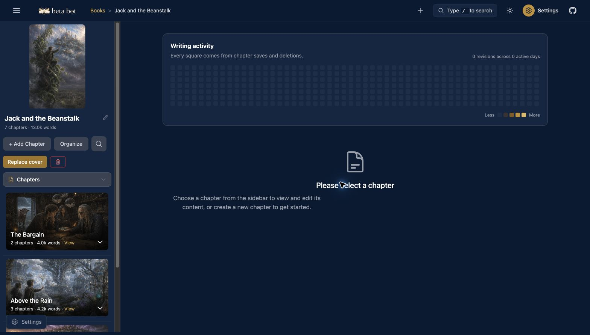
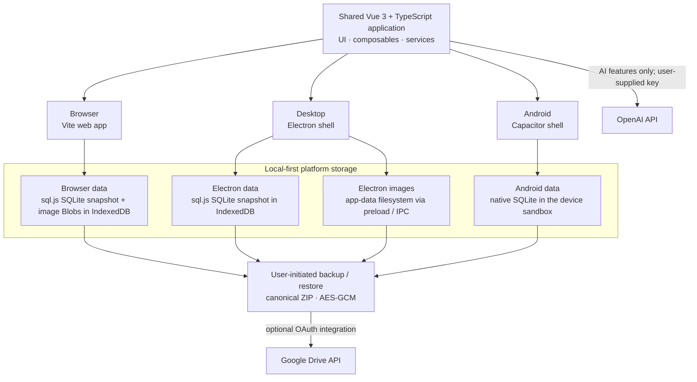

<p align="center">
  
</p>

# beta bot

[](https://github.com/gennitdev/ai-beta-reader-frontend/actions/workflows/ci.yml)
[](https://codecov.io/gh/gennitdev/ai-beta-reader-frontend)
[](LICENSE)

A local-first writing application for managing books and chapters, editing content with a rich markdown editor, generating AI summaries, and getting contextual feedback on your writing.

**[Open beta-bot.net](https://beta-bot.net)** · **[Browse the example library](https://beta-bot.net/example-books)** — a complete illustrated book you can explore with no account and no API key · [Privacy](https://beta-bot.net/privacy) · [Terms](https://beta-bot.net/terms)



Your writing stays on your device. This repository contains the complete application code for the browser, Electron desktop, and Android builds, and there is no application backend or API server anywhere in it. SQLite lives on the user's device, so there is no application database to host; AI requests go directly to OpenAI using the API key the user configures, and optional encrypted backups go directly to Google Drive. Nothing to run, host, or secure, and no shared server holding anyone's writing.

<details>
<summary>Why there is no backend anymore</summary>

Earlier versions relied on a companion Express server to store data and proxy AI and cloud requests. The current architecture no longer needs it: the app is local-first and talks directly to OpenAI and Google Drive from the client, so there is nothing left for a server to do. The `ai-beta-reader-express` project is kept only for reference; it is not part of the running application, and `src/services/api.ts` remains as unused legacy compatibility code that should not be used for new features.

</details>

## Your data

- **Your manuscript lives on your device.** Books, chapters, summaries, wiki pages, and images are stored in a local SQLite database. Nothing is uploaded in the background.
- **AI features send only what you ask for, when you ask for it.** Generating a summary or requesting a review sends that chapter's text, plus the earlier summaries used as context, directly to OpenAI under your own API key. No AI request is made unless you initiate it, and you can inspect the complete prompt before sending it.
- **Backups are user-initiated and encrypted before they leave.** A backup builds a canonical library ZIP, encrypts it with a key derived from your password (PBKDF2, then AES-GCM through the Web Crypto API), and uploads it to your own Google Drive under the `drive.file` scope, which limits the app to files it created. Restore only reads. Nothing is ever uploaded automatically.
- **Your keys and passwords are not collected.** OpenAI API keys are encrypted at rest with OS-backed secure storage on Electron and Android; browser builds keep a remembered key in browser storage, because a browser cannot reach an OS keychain. API keys are never included in backups, and the backup password is never stored — losing it makes that backup unreadable.

The in-app [Privacy Policy](https://beta-bot.net/privacy) and [Terms of Use](https://beta-bot.net/terms) carry the full statement.

## Tech Stack

- **Application:** Vue 3 (Composition API) + TypeScript + Vite
- **Styling:** Tailwind CSS + Headless UI + Heroicons
- **State & Data:** Vue composables backed by local SQLite repositories
- **Local Database:** `sql.js` + IndexedDB persistence (browser and Electron) / `@capacitor-community/sqlite` (Android)
- **Cloud Sync:** Google Drive via OAuth 2.0 (GIS for web, Google Identity Services authorization for Android)
- **AI Services:** OpenAI (GPT‑4o Mini) for summaries & reviews
- **Native Platforms:** Capacitor for Android; Electron for desktop (packaging currently configured for macOS and Windows)

## Architecture


```mermaid
flowchart TB
  app["Shared Vue 3 + TypeScript application<br/>UI · composables · services"]

  app --> web["Browser<br/>Vite web app"]
  app --> electron["Desktop<br/>Electron shell"]
  app --> android["Android<br/>Capacitor shell"]

  subgraph local["Local-first platform storage"]
    webDb["Browser data<br/>sql.js SQLite snapshot + image Blobs in IndexedDB"]
    electronDb["Electron data<br/>sql.js SQLite snapshot in IndexedDB"]
    electronImages["Electron images<br/>app-data filesystem via preload / IPC"]
    androidDb["Android data<br/>native SQLite in the device sandbox"]
  end

  web --> webDb
  electron --> electronDb
  electron --> electronImages
  android --> androidDb

  app -->|"AI features only; user-supplied key"| openai["OpenAI API"]

  webDb --> backup["User-initiated backup / restore<br/>canonical ZIP · AES-GCM"]
  electronDb --> backup
  electronImages --> backup
  androidDb --> backup
  backup -->|"optional OAuth integration"| drive["Google Drive API"]
```

The browser, desktop, and Android targets share the same application and portable backup format. Platform adapters only change how the local SQLite database and image binaries are stored. OpenAI and Google Drive are contacted directly from the running client; there is no application server between them.

See [Your data](#your-data) for what leaves the device and how credentials are stored on each platform.

## Features

### Core Writing Tools

- **Book Management**: Create and organize your writing projects with support for parts/sections
- **Chapter Editor**: Rich markdown editor with live preview and word count tracking
- **Version history**: Each save that changes a chapter keeps a revision. Compare any saved version against the one before it, restore it, or permanently discard it
- **Read-only example library**: Explore a complete illustrated book — chapters, summaries, story bible, and illustrations — without an account, an API key, or any effect on your own library
- **Responsive Design**: Works seamlessly on desktop and mobile devices

### AI-Powered Features

- **Smart Chapter Summaries**: Auto-generate structured summaries that track plot points, characters, locations, and key events to maintain continuity across long manuscripts
  - A checkbox lets you update wiki pages for characters and locations detected while generating or regenerating a summary
  - Missing pages are created, existing pages are refreshed with new chapter information, and each result is linked back to its source chapter
- **Contextual AI Reviews**: Get intelligent feedback that understands your entire story:
  - Reviews use summaries of previous chapters as context
  - No need to explain backstory - the AI already knows what happened
  - Efficient token usage even for long manuscripts
- **Multiple Review Styles**:
  - Fan style (enthusiastic reader feedback)
  - Editorial notes (developmental editor perspective)
  - Line editor (concrete, actionable suggestions)
- **Custom AI Profiles**: Create personalized reviewer profiles with custom prompts to get the exact type of feedback you need

### Continuity Management & Storage

- **Local-first data**: Every project lives in a local SQLite database. Backups are user-initiated; AI features send the selected manuscript context to the configured AI service when invoked.
- **Encrypted backups**: The complete canonical library ZIP is encrypted with a password-derived AES-GCM key and uploaded to Google Drive as a new immutable generation. The three newest successful generations are retained.
- **Cross-platform restore**: Browser, Electron, and Android use the same canonical bundle format. Restore also retains permanent compatibility with older WC1, WC2, and CryptoJS-encrypted JSON backups. Android uses Google Play services authorization without a browser redirect.
- **Book bundle import**: Add a new book—or apply later Git-workspace edits to an installed book—directly from My Books using a validated bundle ZIP or folder.
- **Book deletion**: Remove a book together with everything attached to it — chapters, revisions, summaries, reviews, notes, wiki pages, and image assets — after a preview of exactly what will be deleted.
- **Git-ready workspaces**: Chromium-class browsers can safely update canonical bundle folders without overwriting unknown files. New workspaces include maintained agent instructions and a conservative `.gitattributes` policy.
- **Story bible**: Character sheets and wiki pages can record human-edited alternate names, helping AI updates resolve nicknames and titles to one canonical page.
- **Find & replace**: Rename characters/places everywhere in one shot.
- **Drag & drop parts**: Reorder chapters and group them into parts.

### Chapter Illustrations

- **Browser and Electron image management**: Add and manage chapter illustrations plus book, part, and chapter covers
- **Local binary storage**: Browser images are stored as IndexedDB `Blob` records; Electron images live in the app-data directory
- **Chapter covers**: Set any illustration as the chapter's cover image for visual navigation
- **Lightbox viewer**: View images full-screen with download option
- **Storage and backup**: Drive backup includes verified image bytes in the encrypted canonical bundle so browser and Electron restores preserve the image library.
- **Content integrity**: Image bytes use versioned SHA-256 metadata for migration and restore verification. See [`docs/image-content-integrity.md`](docs/image-content-integrity.md) for the format and deduplication decision.

### Bardwall — a game that rewards writing

Bardwall is an optional, illustrated mini-game woven into the app: a haunted town whose economy runs entirely on stories. The walls keep out many things; they have never managed to keep out a story.


- **Tell the ghosts your pages**: at the Stone Amphitheater, passages you actually added in your saved chapter revisions can be "told" for coins — the game only pays out for words you really wrote.
- **A town to explore**: a painted map of clickable destinations — the Crooked Lantern Inn, the Shrine of Heliconia (goddess of lost causes and unwinnable games), the Moth & Mortar apothecary, the Night Market, and the Ink & Ember coffeehouse.
- **Story wagers**: at Ink & Ember, draw painted tarot-style cards and wager coins or food on a story contest judged against a rival bard.
- **Unwinnable games**: beyond the wall lies a cave where Vesper, an elderly chiropteran, plays The Game of the Last Word — you can never get the last word — and a courteous wyrm offers its hoard for the one cordial that won't make you ill.
- **Daily measure & upkeep**: set a daily word goal, earn coins, buy food, and sleep at the inn or in a tent beyond the wall; hunger and energy carry into the next day.
- **Purely additive**: Bardwall keeps its own local state — your books, chapters, and revisions are never changed by playing.

## Screenshots

The screenshot above is the built-in Jack and the Beanstalk example: a complete illustrated workspace with parts, chapters, summaries, and a connected story bible. You can [click through the same book live](https://beta-bot.net/example-books). Expand any section below for more.

<details>
<summary><strong>Structured chapter summaries</strong></summary>

Chapter summaries track the point-of-view character, cast, and key beats used as context for AI reviews. You can inspect, edit, or regenerate them at any time.


</details>

<details>
<summary><strong>Transparent AI review setup</strong></summary>

Choose the reviewer perspective that best fits the manuscript and inspect its complete AI prompt before requesting feedback.


</details>

<details>
<summary><strong>Custom AI profiles</strong></summary>

Create personalized reviewer profiles with custom prompts to get the exact type of feedback you need.


</details>

<details>
<summary><strong>Character wiki system</strong></summary>

Wiki pages connect characters and locations to their source chapters and tagged illustrations. They can be maintained by hand or updated as part of chapter summary generation. Before selecting **Generate** or **Regenerate**, use the **Update wiki pages for detected characters and locations** checkbox to control whether the AI should:

- Create pages for newly detected characters and locations
- Add relevant chapter information to existing pages
- Record the source chapter and a history entry for each creation or update
- Resolve nicknames, titles, and other alternate names to an existing canonical page

After generation, the summary panel reports which pages were created, updated, or left unchanged and provides links to review them.


</details>

<details>
<summary><strong>Search and replace for continuity</strong></summary>

Review individual matches before replacing text across your entire manuscript, or limit the operation to the current chapter or wiki page. Matches are grouped by document and field, with controls to replace one, selected matches, or every match in a document.


</details>

## Running Locally

beta bot is a client application, so running it means a Vite dev server or a static build. There is no server to provision and no database to host.

### Prerequisites

- Node.js 22.12+ or 24+
- An OpenAI API key, entered in the app, to use AI summaries and reviews
- Optional: a Google Cloud project with the Drive API enabled and appropriate OAuth clients if you want Google Drive backup and restore

### Setup

1. **Install dependencies:**

   ```bash
   pnpm install
   ```

2. **Optional: configure Google Drive backup and restore:**
   Copy `.env.example` to `.env.local` and supply the Google OAuth client IDs for the platforms you intend to run. You can skip this step when Drive sync is not needed.

3. **Start development server:**

   ```bash
   pnpm dev
   ```

## Environment Variables

Create a `.env.local` file (or copy [.env.example](.env.example)) and configure the following variables.

> Full walkthrough (OAuth clients, SHA‑1s, troubleshooting): see [`docs/cloud-sync.md`](docs/cloud-sync.md).

### Google OAuth (Drive sync)

| Variable | Description | Example |
|----------|-------------|---------|
| `VITE_GOOGLE_CLIENT_ID` | Google OAuth *web* client ID (used for browser GIS flow) | `302250506015-du7cd7e5g469dd74cs2fnq8luksiuutb.apps.googleusercontent.com` |
| `VITE_GOOGLE_CLIENT_ID_WEB` | Optional alias for the web client (defaults to `VITE_GOOGLE_CLIENT_ID`) | same as above |
| `VITE_GOOGLE_CLIENT_ID_DESKTOP` | OAuth desktop client used by Electron's loopback flow | `…apps.googleusercontent.com` |
| `VITE_GOOGLE_CLIENT_SECRET_DESKTOP` | Optional desktop-client secret, when required by the configured OAuth client | |

### Notes

- All environment variables exposed to the Vite application must be prefixed `VITE_`.
- `.env.local` is git-ignored; replicate values in Vercel → Project → Environment Variables for production/preview builds.
- The app does not require `VITE_API_BASE_URL` or a separately running Express server.

## How the App Works

### Local-first Database

- **Browser and Electron builds** run `sql.js` (SQLite compiled to WebAssembly). The exported SQLite bytes are persisted in IndexedDB under the `ai-beta-reader-db` database. Existing installs with the legacy `localStorage.sqliteDb` value migrate it to IndexedDB during startup.
- **Android builds** use `@capacitor-community/sqlite`. Data lives in the device sandbox in the `ai-beta-reader` database.
- All user actions (adding books, editing chapters, creating wiki entries) mutate the local DB immediately.
- User-facing export/import uses the versioned canonical library bundle. Internally, named database snapshots bridge the platform storage engines to the shared bundle codec.
- Browser image bytes live in the IndexedDB `imageBlobs` object store. SQLite keeps only image metadata during normal use; legacy base64 rows migrate automatically in restartable batches.

### Plain-text bundle round trips

Beta bot's bundle format lets the visual app and a plain-text writing workflow share the same book. This is useful when you want the app for reading, organization, illustrations, summaries, and story-bible navigation, but prefer editing Markdown and YAML in a text editor—or with an AI coding tool such as the Codex or Claude desktop app or CLI.

1. In beta bot, choose **Editable text workspace** as the export format, select the books you want, and export a folder or ZIP.
2. Open the exported workspace in your editor, a Git repository, Codex, or Claude. Chapters, part summaries, chapter summaries, and wiki pages are ordinary Markdown; book structure and relationships use YAML.
3. Edit and review the changes as normal text diffs. Keep existing entity IDs and frontmatter relationships intact, and do not edit anything under `_beta-bot/`. Its inventory is the immutable export-time baseline; changing or regenerating it would erase Beta Bot's evidence of your edits.
4. Return to **My Books → Import Bundle**. Beta bot previews every create, update, and conflict before anything is written to the local library.
5. After Apply changes succeeds, export to the workspace again before beginning another external editing round. This records the accepted app state as the next comparison baseline while preserving unknown files and customized workspace instructions.

This makes the bundle a round-trip workspace rather than a one-way export. The inventory plays the role of a Git merge base: import compares that original export, the current app library, and the incoming edited files. You can move between the UI and plain text repeatedly, keep the workspace under Git, and resolve overlapping edits explicitly during import. Full-library bundles remain the right choice for backup and device migration because they include image bytes, history, profiles, and audit data; text-only workspaces are optimized for editing and preserve matching local image content when reapplied.

### Google Drive Backup & Restore

1. **Backup** (`User Settings → Back up to Drive`)
   - Prompts for a password, builds the canonical full-library ZIP, derives a key with PBKDF2, and encrypts the ZIP with AES-GCM through the Web Crypto API.
   - Uploads a new `ai-beta-reader-library-<timestamp>.enc` generation with Drive scope `drive.file`, then retains the three newest successful generations.
   - Records ciphertext length, SHA-256, app version, and bundle format in Drive metadata. Older generations are removed only after the new upload is complete and verified.
   - Every platform uses the same canonical bundle codec. Browser and Electron include local image bytes. Android has no local image-binary store, so a backup fails clearly if image metadata refers to bytes that are unavailable on that device.
   - Use **Show Available Backups** in Settings to inspect the retained generation metadata.

2. **Restore** (`User Settings → Restore from Drive`)
   - Auth flow differs by platform:
     - **Web**: Google Identity Services token client (`response_type=token`).
     - **Electron**: Desktop OAuth client with a loopback callback handled by the preload bridge.
     - **Android**: A Capacitor bridge calls Google Play services `AuthorizationClient`. Google identifies the OAuth client from the application package and signing certificate, and returns a short-lived access token without a redirect URI.
   - Downloads the selected (or newest) encrypted generation, verifies its recorded integrity, decrypts it, and validates the complete bundle.
   - Creates and verifies an external recovery bundle before replacing the local library, with automatic rollback if replacement fails.
   - If no versioned generation exists, restore falls back to the legacy `ai-beta-reader-backup.enc` file. WC1, WC2, and CryptoJS-encrypted JSON remain supported.
   - Electron writes restored image data to its filesystem. The browser writes it to IndexedDB Blob storage. Android strips image binary data during restore and keeps the metadata.
   - Foreign key constraints are disabled temporarily during import to avoid ordering errors.
   - Nothing gets uploaded automatically—restore only reads from Drive. You decide when to back up.

3. **Security**
   - Backups stay in your Google Drive. Only the authenticated account (or anyone you explicitly share the file with) can download it.
   - The encryption password is never stored; losing it makes the backup unreadable.
   - Electron and Android store OAuth tokens through OS-backed secure storage. Browser GIS tokens are short-lived and browser-local.

See [`docs/cloud-sync.md`](docs/cloud-sync.md) for troubleshooting (client secrets, SHA‑1 mismatches, status bar overlays, etc.).

### Folder export and validation

- **Complete library backup ZIP** is the default choice for recovery, safekeeping, and device transfer. It is portable and contains the entire library.
- **Update complete backup folder** is an advanced, unpacked version of the same complete data. Use it for local archival or inspection when a normal ZIP is inconvenient; it is not the recommended external-editing workflow.
- **Editable text workspace** is the recommended export for drafting in Git, an editor, or a coding agent, followed by an Apply changes import. It deliberately omits image bytes and app-owned history, so it is not a backup.
- Existing bundles are updated from their prior inventory: unknown files and customized workspace guidance are preserved, and obsolete managed files are removed only after verified writes.
- Validate either transport without opening the app or database:

  ```bash
  pnpm validate:bundle -- /path/to/library-folder-or.zip
  ```

See [`docs/agent-workspaces.md`](docs/agent-workspaces.md) for the rollback model, generated `AGENTS.md`, and recommended Git attributes.

### AI Summaries & Reviews

- Every chapter can generate a “structured summary” capturing POV, characters, beats, spoilers.
- When requesting feedback, the prompt includes:
  - Current chapter text
  - Summaries of previous chapters
  - Relevant metadata (characters, wiki info)
- Multiple reviewer tones (fan, editorial, line edit) + custom profiles stored in the local DB.

### Search, Wiki, and Story Bible

- Wiki pages track characters, locations, concepts, and other story information with update history.
- Summary generation can optionally create or update detected character and location pages, then link them to the source chapter.
- Cross-document search covers chapters + wiki entries.
- Find/replace spans every chapter to keep continuity.
- Chapters can be grouped into parts and reordered via drag & drop.

## Development Workflow

```bash
pnpm install          # install deps for the app and Electron workspace
pnpm dev              # local dev server (Vite)
pnpm build            # type-check + production bundle (outputs to dist/)
pnpm preview          # serve production bundle locally

# Lint and types
pnpm lint             # ESLint check
pnpm lint:fix         # ESLint autofix
pnpm type-check       # vue-tsc --build (browser app)
pnpm type-check:electron  # Electron main/preload types
pnpm type-check:e2e   # Playwright spec types

# Tests
pnpm test:unit             # Vitest unit suite
pnpm test:coverage         # Vitest with coverage
pnpm test:coverage:strict  # coverage with the enforced thresholds
pnpm test:fuzz             # property/fuzz suite for the bundle codec
pnpm test:e2e              # Playwright browser suite
pnpm test:electron         # Electron runtime unit suite
pnpm test:electron-security # Electron sandbox/IPC security checks

# Bundles and fixtures
pnpm validate:bundle -- /path/to/bundle  # offline directory/ZIP validation
pnpm benchmark:bundle     # bundle stress benchmarks (smoke scale by default)
pnpm example-story:sync   # rebuild the demo book ZIP from ../example-story-jack

# Android
pnpm exec cap sync android # sync Capacitor plugins & web assets (run after build)
pnpm exec cap run android --target <serial>  # deploy to device/emulator

# Electron Desktop
pnpm install                  # installs Electron dependencies via the workspace
pnpm electron:dev             # build and launch with the live runner
pnpm electron:build           # create configured distributable packages
```

CI runs lint, browser and Electron type checks, the production build, coverage, Electron runtime tests, and the Playwright suite. Run `pnpm lint`, `pnpm type-check`, `pnpm type-check:electron`, and `pnpm test:unit` before pushing to catch the common failures locally.

## Contributing

Contribution guidelines — project layout, coding style, testing expectations, and pull request checklists — live in [AGENTS.md](AGENTS.md). Pull request titles follow Conventional Commits so squash merges can drive semantic versioning; see [Releases](docs/releases.md) for title examples and the automated GitHub release process.

## Hosting & Deployment

- **Web (beta-bot.net)**: Vercel builds from `main`. Make sure the env vars above are set in Vercel before deploying.
- **Android**: Use `pnpm exec cap sync android` after every `pnpm build`. Launch via Android Studio or the `pnpm exec cap run` helper.
  - The production Android OAuth client must include:
    - Package name `com.betareader.app`
    - Google Play **app-signing certificate** SHA‑1 from Play Console → Setup → App integrity. The upload-key SHA‑1 identifies the upload artifact, not the Play-installed production app.
  - Local debug builds need a separate Android OAuth client entry for `com.betareader.app` and the debug certificate SHA‑1 shown by `./gradlew signingReport`.
  - Status bar height is handled via `@capacitor/status-bar` to avoid UI overlap.
- **Electron Desktop**: Run `pnpm electron:dev` for development or `pnpm electron:build` for configured packages.
  - Uses the same `sql.js` + IndexedDB database persistence as the browser build.
  - Uses an Electron preload/IPC bridge for native file selection and image filesystem access.
  - Image files live in the Electron app-data directory and are embedded in user-initiated encrypted Drive backups.

## Troubleshooting Cheat Sheet

| Problem | Fix |
|---------|-----|
| `No backup found in cloud storage` | No versioned generation or legacy `ai-beta-reader-backup.enc` exists. Run a backup or verify the legacy file still exists. |
| A restored backup is missing images on Android | Android has no local image-binary store, so restore keeps image metadata and strips the bytes. Restore that bundle on a browser or Electron build to recover the image library. |
| `adb` can’t find the device | Reconnect cable, enable File Transfer mode, rerun `adb kill-server && adb start-server`, accept the trust prompt. |

Google Drive and Android OAuth problems — denied authorization, SHA‑1 mismatches, internal-test builds that cannot sign in — are covered in full by [`docs/cloud-sync.md`](docs/cloud-sync.md).

## Need More Detail?

- [Canonical library bundle](docs/book-folder-format.md) – format contract, import safety, and implementation status.
- [Git and agent workspaces](docs/agent-workspaces.md) – folder updates, validation, and generated workspace files.
- [Google Drive backup and restore](docs/cloud-sync.md) – OAuth setup, platform behavior, and troubleshooting.
- [Image library storage](docs/desktop-images.md) – browser/Electron image persistence and backup behavior.
- [Image content integrity](docs/image-content-integrity.md) – content hashing, migration, and the deduplication decision.
- [Browser image parity design record](docs/browser-image-parity-plan.md) – completed migration design and deferred work.
- [Bundle release hardening](docs/release-hardening.md) – the verification tracks and acceptance evidence for large-library bundles.
- [Bundle stress benchmarks](docs/bundle-stress-benchmarks.md) – how the large-library export, validate, and Replace benchmarks are run.
- [Electron macOS packaging](docs/developer/electron-macos-packaging.md) – signing and notarization work that distribution still needs.
- [Releases](docs/releases.md) – Conventional Commit titles and automated releases.

## License

Released under the [MIT License](LICENSE).

Happy writing! ✍️📚
