<p align="center">
  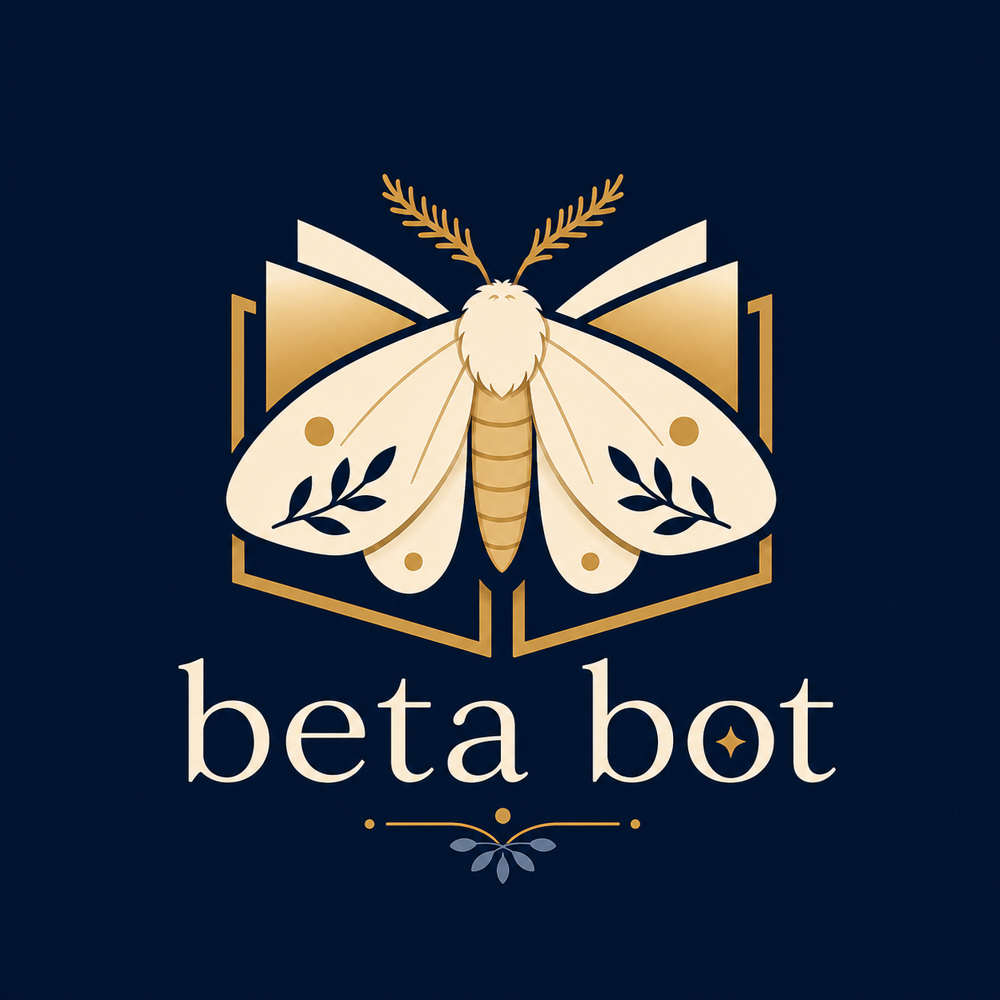
</p>

# beta bot

[](https://github.com/gennitdev/ai-beta-reader-frontend/actions/workflows/ci.yml)
[](https://codecov.io/gh/gennitdev/ai-beta-reader-frontend)

A local-first writing application for managing books and chapters, editing content with a rich markdown editor, generating AI summaries, and getting contextual feedback on your writing.

This repository contains the complete application code for the browser, Electron desktop, and Android builds. No separate application backend or API server is required: writing data is stored locally, AI requests are sent directly to OpenAI using the API key configured by the user, and optional encrypted backups communicate directly with Google Drive.

> **Why the backend is deprecated:** earlier versions relied on a companion Express server to store data and proxy AI and cloud requests. The current architecture no longer needs it. The app is local-first — SQLite lives on the user's device, so there is no application database to host — and it talks directly to OpenAI and Google Drive from the client, so there is nothing left for a server to do. Removing it means no infrastructure to run, host, or secure, and no shared server holding users' writing. The `ai-beta-reader-express` project is kept only for reference; it is not part of the running application.

## Tech Stack

- **Application:** Vue 3 (Composition API) + TypeScript + Vite
- **Styling:** Tailwind CSS + Headless UI + Heroicons
- **State & Data:** Vue composables backed by local SQLite repositories
- **Local Database:** `sql.js` + IndexedDB persistence (browser and Electron) / `@capacitor-community/sqlite` (Android)
- **Cloud Sync:** Google Drive via OAuth 2.0 (GIS for web, PKCE + App Links for native)
- **AI Services:** OpenAI (GPT‑4o Mini) for summaries & reviews
- **Native Platforms:** Capacitor for Android; Electron for desktop (packaging currently configured for macOS and Windows)

## Architecture

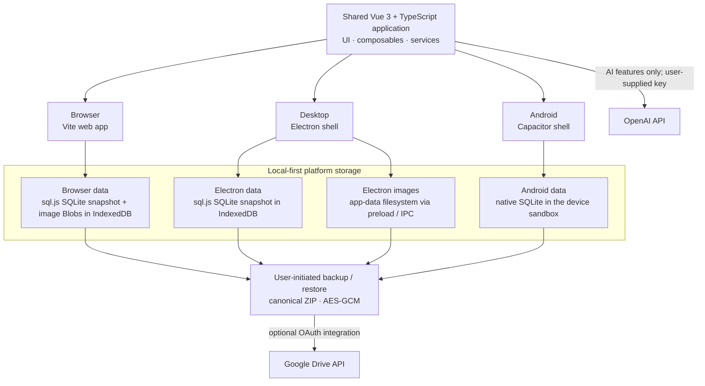
```mermaid
flowchart TB
  app["Shared Vue 3 + TypeScript application<br/>UI · composables · services"]

  app --> web["Browser<br/>Vite web app"]
  app --> electron["Desktop<br/>Electron shell"]
  app --> android["Android<br/>Capacitor shell"]

  subgraph local["Local-first platform storage"]
    webDb["Browser data<br/>sql.js SQLite snapshot + image Blobs in IndexedDB"]
    electronDb["Electron data<br/>sql.js SQLite snapshot in IndexedDB"]
    electronImages["Electron images<br/>app-data filesystem via preload / IPC"]
    androidDb["Android data<br/>native SQLite in the device sandbox"]
  end

  web --> webDb
  electron --> electronDb
  electron --> electronImages
  android --> androidDb

  app -->|"AI features only; user-supplied key"| openai["OpenAI API"]

  webDb --> backup["User-initiated backup / restore<br/>canonical ZIP · AES-GCM"]
  electronDb --> backup
  electronImages --> backup
  androidDb --> backup
  backup -->|"optional OAuth integration"| drive["Google Drive API"]
```

The browser, desktop, and Android targets share the same application and portable backup format. Platform adapters only change how the local SQLite database and image binaries are stored. OpenAI and Google Drive are contacted directly from the running client; there is no application server between them.

OpenAI API keys are encrypted at rest with OS-backed secure storage in Electron and Android builds. Browser builds cannot access an OS keychain, so a key remembered there is kept in the site's browser storage. Keys are never included in application backups.

## Features

### Core Writing Tools

- **Book Management**: Create and organize your writing projects with support for parts/sections
- **Chapter Editor**: Rich markdown editor with live preview and word count tracking
- **Responsive Design**: Works seamlessly on desktop and mobile devices

### AI-Powered Features

- **Smart Chapter Summaries**: Auto-generate structured summaries that track plot points, characters, locations, and key events to maintain continuity across long manuscripts
  - A checkbox lets you update wiki pages for characters and locations detected while generating or regenerating a summary
  - Missing pages are created, existing pages are refreshed with new chapter information, and each result is linked back to its source chapter
- **Contextual AI Reviews**: Get intelligent feedback that understands your entire story:
  - Reviews use summaries of previous chapters as context
  - No need to explain backstory - the AI already knows what happened
  - Efficient token usage even for long manuscripts
- **Multiple Review Styles**:
  - Fan style (enthusiastic reader feedback)
  - Editorial notes (developmental editor perspective)
  - Line editor (concrete, actionable suggestions)
- **Custom AI Profiles**: Create personalized reviewer profiles with custom prompts to get the exact type of feedback you need

### Continuity Management & Storage

- **Local-first data**: Every project lives in a local SQLite database. Backups are user-initiated; AI features send the selected manuscript context to the configured AI service when invoked.
- **Encrypted backups**: The complete canonical library ZIP is encrypted with a password-derived AES-GCM key and uploaded to Google Drive as a new immutable generation. The three newest successful generations are retained.
- **Cross-platform restore**: Browser, Electron, and Android use the same canonical bundle format. Restore also retains permanent compatibility with older WC1, WC2, and CryptoJS-encrypted JSON backups. Android uses PKCE OAuth and App Links to re-enter the app after Google consent.
- **Git-ready workspaces**: Chromium-class browsers can safely update canonical bundle folders without overwriting unknown files. New workspaces include maintained agent instructions and a conservative `.gitattributes` policy.
- **Story bible**: Character sheets and wiki pages can record human-edited alternate names, helping AI updates resolve nicknames and titles to one canonical page.
- **Find & replace**: Rename characters/places everywhere in one shot.
- **Drag & drop parts**: Reorder chapters and group them into parts.

### Chapter Illustrations

- **Browser and Electron image management**: Add and manage chapter illustrations plus book, part, and chapter covers
- **Local binary storage**: Browser images are stored as IndexedDB `Blob` records; Electron images live in the app-data directory
- **Chapter covers**: Set any illustration as the chapter's cover image for visual navigation
- **Lightbox viewer**: View images full-screen with download option
- **Storage and backup**: Drive backup includes verified image bytes in the encrypted canonical bundle so browser and Electron restores preserve the image library.

### Bardwall — a game that rewards writing

Bardwall is an optional, illustrated mini-game woven into the app: a haunted town whose economy runs entirely on stories. The walls keep out many things; they have never managed to keep out a story.

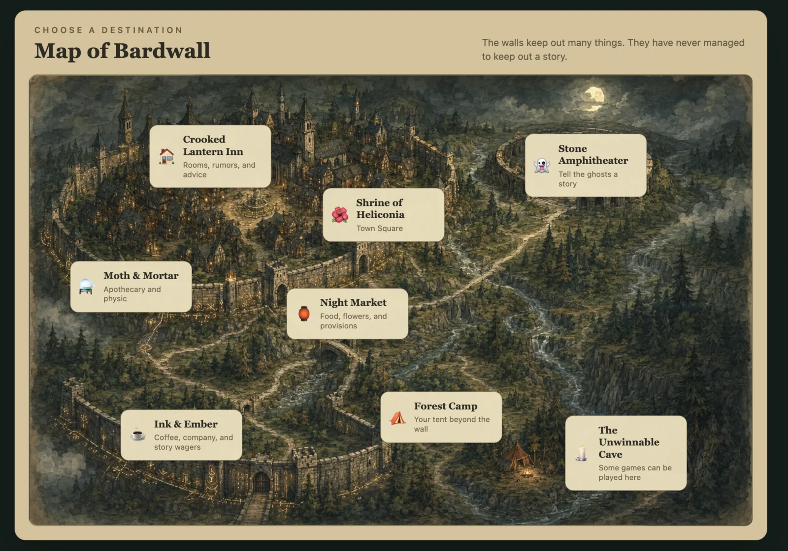

- **Tell the ghosts your pages**: at the Stone Amphitheater, passages you actually added in your saved chapter revisions can be "told" for coins — the game only pays out for words you really wrote.
- **A town to explore**: a painted map of clickable destinations — the Crooked Lantern Inn, the Shrine of Heliconia (goddess of lost causes and unwinnable games), the Moth & Mortar apothecary, the Night Market, and the Ink & Ember coffeehouse.
- **Story wagers**: at Ink & Ember, draw painted tarot-style cards and wager coins or food on a story contest judged against a rival bard.
- **Unwinnable games**: beyond the wall lies a cave where Vesper, an elderly chiropteran, plays The Game of the Last Word — you can never get the last word — and a courteous wyrm offers its hoard for the one cordial that won't make you ill.
- **Daily measure & upkeep**: set a daily word goal, earn coins, buy food, and sleep at the inn or in a tent beyond the wall; hunger and energy carry into the next day.
- **Purely additive**: Bardwall keeps its own local state — your books, chapters, and revisions are never changed by playing.

## Screenshots

### AI Summary Generation

Clicking the generate summary button generates structured summaries that track characters, plot points, and key events for each chapter.

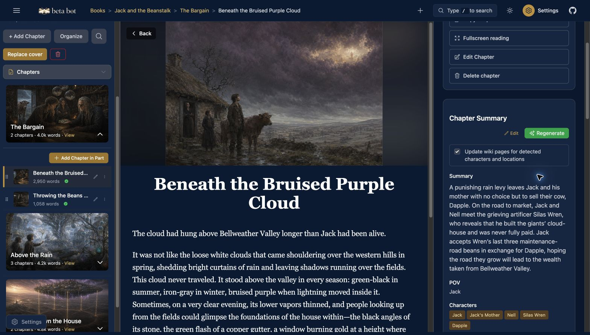

### Summary Management

You can manually edit or regenerate summaries to ensure they accurately capture the important details that will provide context for AI reviews.

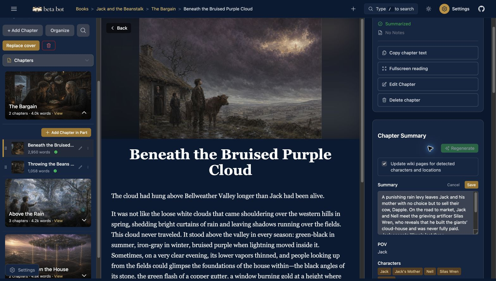

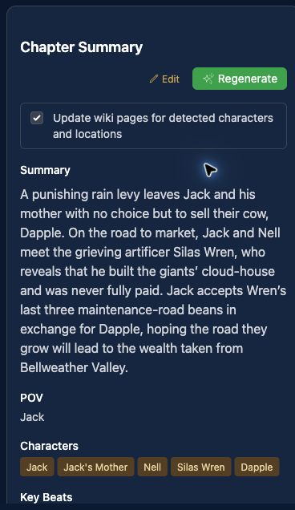

### AI Review Transparency

The app shows you exactly what summaries are being sent to the AI as context, giving you full transparency into the review process.

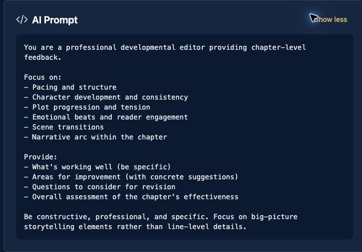

### Contextual AI Feedback

Get intelligent feedback that understands your story's continuity and can catch inconsistencies across chapters.

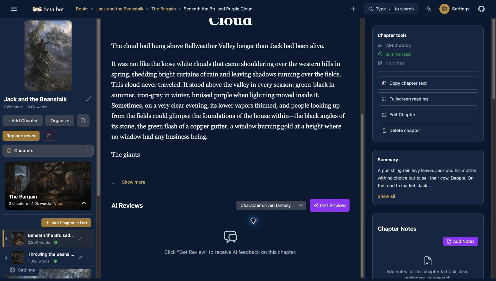

### Custom AI Profiles

Create personalized reviewer profiles with custom prompts to get the exact type of feedback you need.

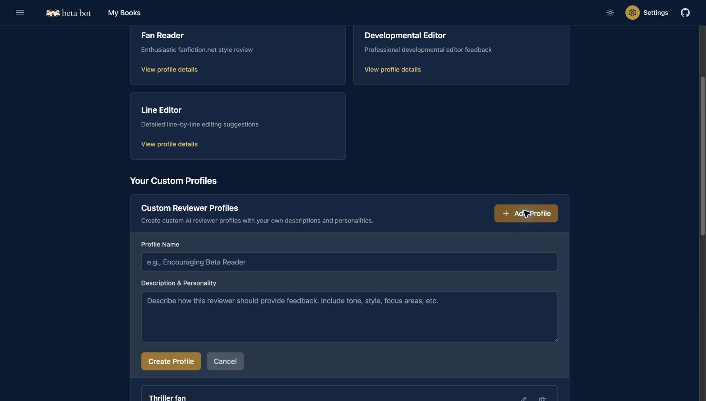

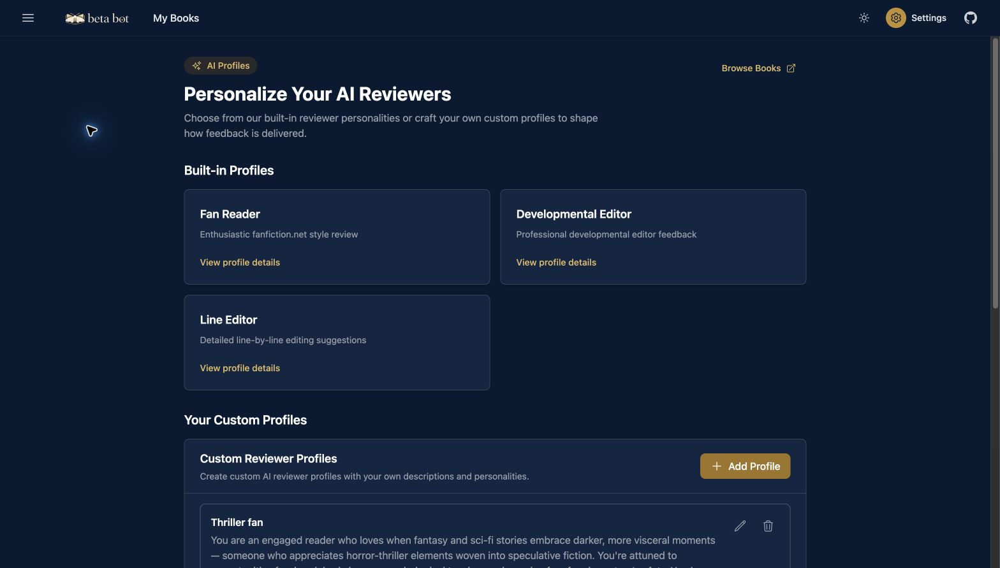


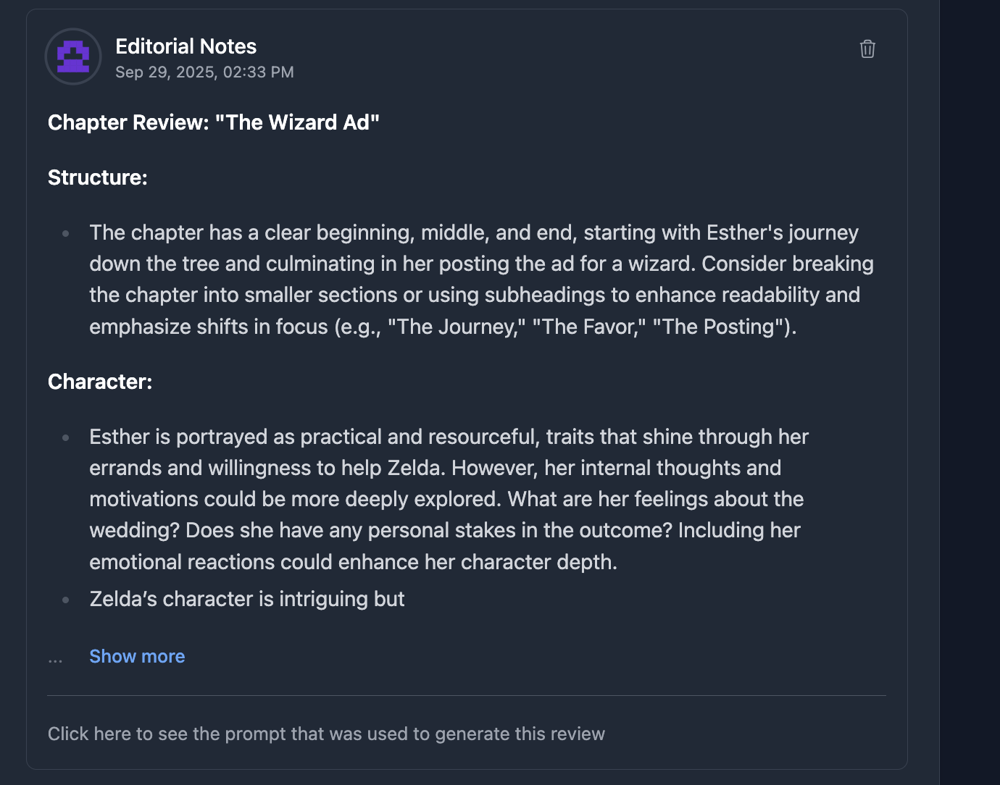

### Character Wiki System

Wiki pages can be maintained by hand or updated as part of chapter summary generation. Before selecting **Generate** or **Regenerate**, use the **Update wiki pages for detected characters and locations** checkbox to control whether the AI should:

- Create pages for newly detected characters and locations
- Add relevant chapter information to existing pages
- Record the source chapter and a history entry for each creation or update
- Resolve nicknames, titles, and other alternate names to an existing canonical page

After generation, the summary panel reports which pages were created, updated, or left unchanged and provides links to review them.

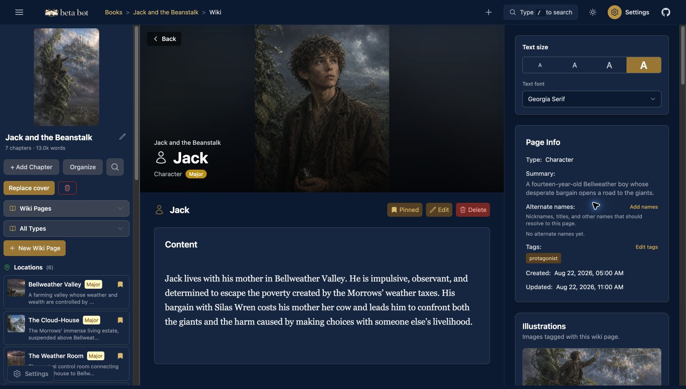

### Search and Replace for Continuity

Review individual matches before replacing text across your entire manuscript, or limit the operation to the current chapter or wiki page. Matches are grouped by document and field, with controls to replace one, selected matches, or every match in a document.

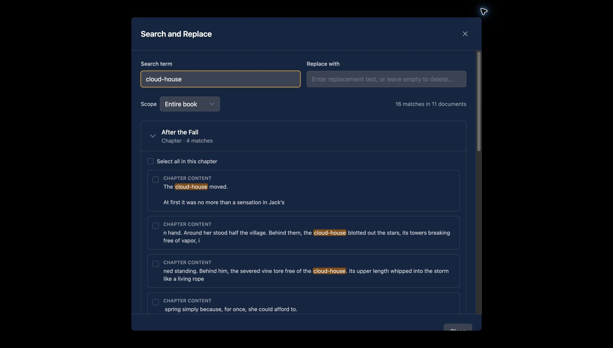

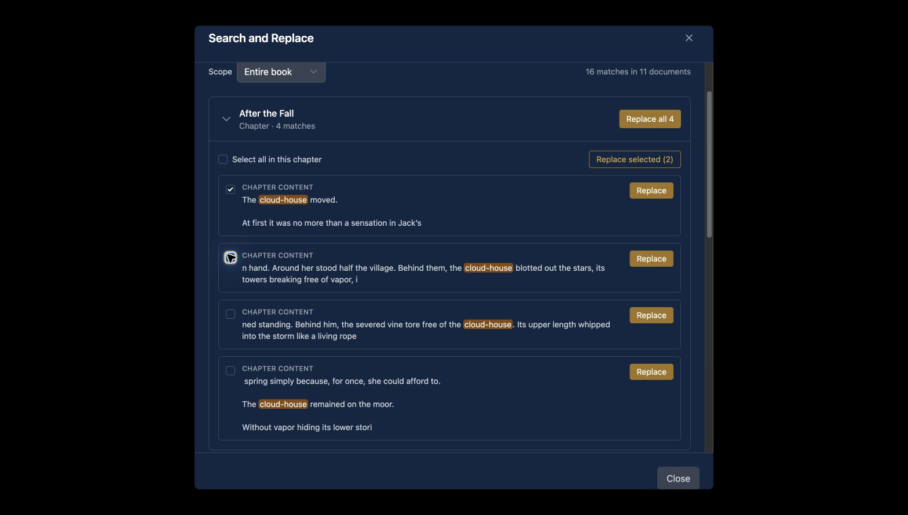

## Prerequisites for Self Hosting beta bot

- Node.js 22.12+ or 24+
- An OpenAI API key, entered in the app, to use AI summaries and reviews
- Optional: a Google Cloud project with the Drive API enabled and appropriate OAuth clients if you want Google Drive backup and restore

## Setup

1. **Install dependencies:**

   ```bash
   npm install
   ```

2. **Optional: configure Google Drive backup and restore:**
   Copy `.env.example` to `.env.local` and supply the Google OAuth client IDs for the platforms you intend to run. You can skip this step when Drive sync is not needed.

3. **Start development server:**

   ```bash
   npm run dev
   ```

## Environment Variables

Create a `.env.local` file (or copy [.env.example](.env.example)) and configure the following variables.

> Full walkthrough (OAuth clients, SHA‑1s, troubleshooting): see [`docs/cloud-sync.md`](docs/cloud-sync.md).

### Google OAuth (Drive sync)

| Variable | Description | Example |
|----------|-------------|---------|
| `VITE_GOOGLE_CLIENT_ID` | Google OAuth *web* client ID (used for browser GIS flow) | `302250506015-du7cd7e5g469dd74cs2fnq8luksiuutb.apps.googleusercontent.com` |
| `VITE_GOOGLE_CLIENT_ID_WEB` | Optional alias for the web client (defaults to `VITE_GOOGLE_CLIENT_ID`) | same as above |
| `VITE_GOOGLE_REDIRECT_URI` | Hosted redirect used by the web build | `https://www.beta-bot.net/oauth2redirect` |
| `VITE_GOOGLE_CLIENT_ID_DESKTOP` | OAuth desktop client used by Electron's loopback flow | `…apps.googleusercontent.com` |
| `VITE_GOOGLE_CLIENT_SECRET_DESKTOP` | Optional desktop-client secret, when required by the configured OAuth client | |
| `VITE_GOOGLE_CLIENT_ID_NATIVE` | Android OAuth client ID (PKCE/native flow) | `…hmm4hpdloehtuodde00pu2irqkpm1inp.apps.googleusercontent.com` |
| `VITE_GOOGLE_REDIRECT_URI_NATIVE` | Custom redirect scheme from the Android client | `com.googleusercontent.apps.…:/oauth2redirect` |
| `VITE_GOOGLE_CLIENT_SECRET` | **Optional** – only required if you re-use the web client in native builds (not recommended) | |

### Notes

- All environment variables exposed to the Vite application must be prefixed `VITE_`.
- `.env.local` is git-ignored; replicate values in Vercel → Project → Environment Variables for production/preview builds.
- The app does not require `VITE_API_BASE_URL` or a separately running Express server.

## How the App Works

### Local-first Database

- **Browser and Electron builds** run `sql.js` (SQLite compiled to WebAssembly). The exported SQLite bytes are persisted in IndexedDB under the `ai-beta-reader-db` database. Existing installs with the legacy `localStorage.sqliteDb` value migrate it to IndexedDB during startup.
- **Android builds** use `@capacitor-community/sqlite`. Data lives in the device sandbox in the `ai-beta-reader` database.
- All user actions (adding books, editing chapters, creating wiki entries) mutate the local DB immediately.
- User-facing export/import uses the versioned canonical library bundle. Internally, named database snapshots bridge the platform storage engines to the shared bundle codec.
- Browser image bytes live in the IndexedDB `imageBlobs` object store. SQLite keeps only image metadata during normal use; legacy base64 rows migrate automatically in restartable batches.

### Google Drive Backup & Restore

1. **Backup** (`User Settings → Back up to Drive`)
   - Prompts for a password, builds the canonical full-library ZIP, derives a key with PBKDF2, and encrypts the ZIP with AES-GCM through the Web Crypto API.
   - Uploads a new `ai-beta-reader-library-<timestamp>.enc` generation with Drive scope `drive.file`, then retains the three newest successful generations.
   - Records ciphertext length, SHA-256, app version, and bundle format in Drive metadata. Older generations are removed only after the new upload is complete and verified.
   - Every platform uses the same canonical bundle codec. Browser and Electron include local image bytes. Android has no local image-binary store, so a backup fails clearly if image metadata refers to bytes that are unavailable on that device.
   - Use **Show Available Backups** in Settings to inspect the retained generation metadata.

2. **Restore** (`User Settings → Restore from Drive`)
   - Auth flow differs by platform:
     - **Web**: Google Identity Services token client (`response_type=token`).
     - **Electron**: Desktop OAuth client with a loopback callback handled by the preload bridge.
     - **Android**: Custom PKCE helper opens Chrome via App Launcher, listens for the app redirect (`com.googleusercontent.apps...:/oauth2redirect`), and exchanges the code for tokens stored through secure storage.
   - Downloads the selected (or newest) encrypted generation, verifies its recorded integrity, decrypts it, and validates the complete bundle.
   - Creates and verifies an external recovery bundle before replacing the local library, with automatic rollback if replacement fails.
   - If no versioned generation exists, restore falls back to the legacy `ai-beta-reader-backup.enc` file. WC1, WC2, and CryptoJS-encrypted JSON remain supported.
   - Electron writes restored image data to its filesystem. The browser writes it to IndexedDB Blob storage. Android strips image binary data during restore and keeps the metadata.
   - Foreign key constraints are disabled temporarily during import to avoid ordering errors.
   - Nothing gets uploaded automatically—restore only reads from Drive. You decide when to back up.

3. **Security**
   - Backups stay in your Google Drive. Only the authenticated account (or anyone you explicitly share the file with) can download it.
   - The encryption password is never stored; losing it makes the backup unreadable.
   - Electron and Android store OAuth tokens through OS-backed secure storage. Browser GIS tokens are short-lived and browser-local.

See [`docs/cloud-sync.md`](docs/cloud-sync.md) for troubleshooting (client secrets, SHA‑1 mismatches, status bar overlays, etc.).

### Folder export and validation

- **Export Git workspace to folder** writes the same canonical files as full ZIP and Drive backup.
- Existing bundles are updated from their prior inventory: unknown files and customized workspace guidance are preserved, and obsolete managed files are removed only after verified writes.
- Validate either transport without opening the app or database:

  ```bash
  npm run validate:bundle -- /path/to/library-folder-or.zip
  ```

See [`docs/agent-workspaces.md`](docs/agent-workspaces.md) for the rollback model, generated `AGENTS.md`, and recommended Git attributes.

### AI Summaries & Reviews

- Every chapter can generate a “structured summary” capturing POV, characters, beats, spoilers.
- When requesting feedback, the prompt includes:
  - Current chapter text
  - Summaries of previous chapters
  - Relevant metadata (characters, wiki info)
- Multiple reviewer tones (fan, editorial, line edit) + custom profiles stored in the local DB.

### Search, Wiki, and Story Bible

- Wiki pages track characters, locations, concepts, and other story information with update history.
- Summary generation can optionally create or update detected character and location pages, then link them to the source chapter.
- Cross-document search covers chapters + wiki entries.
- Find/replace spans every chapter to keep continuity.
- Chapters can be grouped into parts and reordered via drag & drop.

## Development Workflow

```bash
npm install          # install deps
npm run dev          # local dev server (Vite)
npm run build        # type-check + production bundle (outputs to dist/)
npm run preview      # serve production bundle locally
npm run lint         # ESLint check
npm run lint:fix     # ESLint autofix
npm run type-check   # vue-tsc --build
npm run test:unit    # Vitest unit suite
npm run test:coverage # Vitest with coverage
npm run test:e2e     # Playwright browser suite
npm run test:electron # Electron runtime unit suite
npm run validate:bundle -- /path/to/bundle  # offline directory/ZIP validation

# Android
npx cap sync android # sync Capacitor plugins & web assets (run after build)
npx cap run android --target <serial>  # deploy to device/emulator

# Electron Desktop
npm install --prefix electron # first time only
npm run electron:dev          # build and launch with the live runner
npm run electron:build        # create configured distributable packages
```

Pull request titles follow Conventional Commits so squash merges can drive semantic versioning. See [Releases](docs/releases.md) for title examples and the automated GitHub release process.

## Hosting & Deployment

- **Web (beta-bot.net)**: Vercel builds from `main`. Make sure the env vars above are set in Vercel before deploying.
- **Android**: Use `npx cap sync android` after every `npm run build`. Launch via Android Studio or the `npx cap run` helper.
  - The Android OAuth client must include:
    - Package name `com.betareader.app`
    - SHA‑1 fingerprint from `./gradlew signingReport`
    - Custom URI scheme enabled (`com.googleusercontent.apps.<client-id>:/oauth2redirect`)
  - Status bar height is handled via `@capacitor/status-bar` to avoid UI overlap.
- **Electron Desktop**: Run `npm run electron:dev` for development or `npm run electron:build` for configured packages.
  - Uses the same `sql.js` + IndexedDB database persistence as the browser build.
  - Uses an Electron preload/IPC bridge for native file selection and image filesystem access.
  - Image files live in the Electron app-data directory and are embedded in user-initiated encrypted Drive backups.

## Troubleshooting Cheat Sheet

| Problem | Fix |
|---------|-----|
| `client_secret is missing` on restore | The native build is still using the web OAuth client. Ensure Vercel + local envs define `VITE_GOOGLE_CLIENT_ID_NATIVE` and `VITE_GOOGLE_REDIRECT_URI_NATIVE`; redeploy. |
| `Access blocked: request invalid` (custom URI scheme) | Enable “Custom URI scheme” on the Android OAuth client. |
| `Access blocked: invalid_request` after redirect fix | Add the SHA‑1 fingerprint from `./gradlew signingReport` to the Android OAuth client. |
| `No backup found in cloud storage` | No versioned generation or legacy `ai-beta-reader-backup.enc` exists. Run a backup or verify the legacy file still exists. |
| `Failed to decrypt - wrong password? TypeError: this.db.importFromJson is not a function` | Fixed in native import logic (manual inserts). Update to latest build. |
| `FOREIGN KEY constraint failed (code 787)` | Latest build disables/re-enables foreign keys during import. Rebuild and redeploy. |
| `adb` can’t find the device | Reconnect cable, enable File Transfer mode, rerun `adb kill-server && adb start-server`, accept the trust prompt. |

## Need More Detail?

- [Canonical library bundle](docs/book-folder-format.md) – format contract, import safety, and implementation status.
- [Git and agent workspaces](docs/agent-workspaces.md) – folder updates, validation, and generated workspace files.
- [Google Drive backup and restore](docs/cloud-sync.md) – OAuth setup, platform behavior, and troubleshooting.
- [Image library storage](docs/desktop-images.md) – browser/Electron image persistence and backup behavior.
- [Browser image parity design record](docs/browser-image-parity-plan.md) – completed migration design and deferred work.
- [Releases](docs/releases.md) – Conventional Commit titles and automated releases.

Happy writing! ✍️📚
